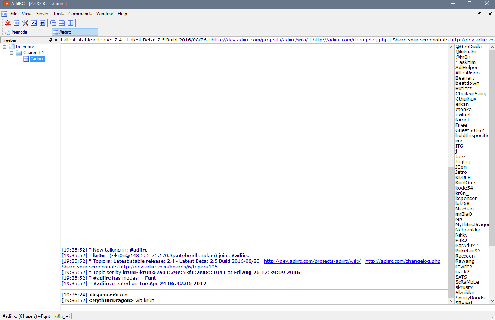
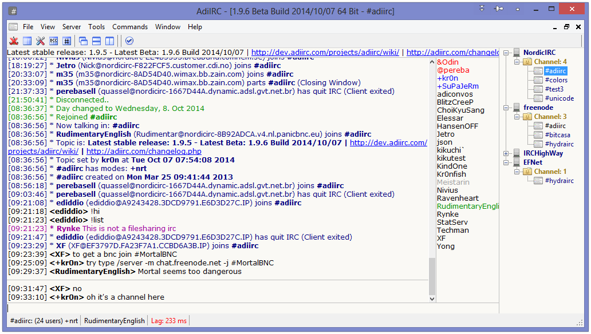
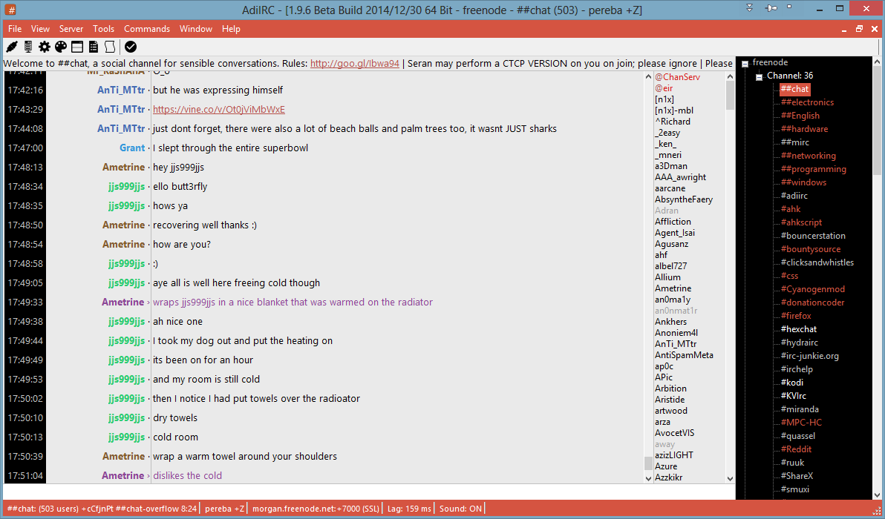
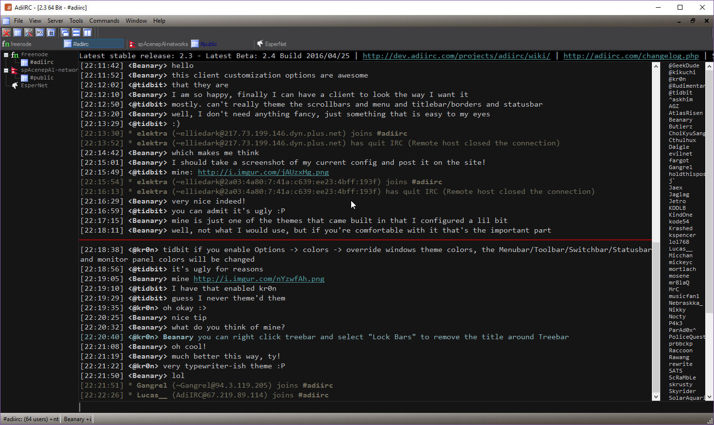
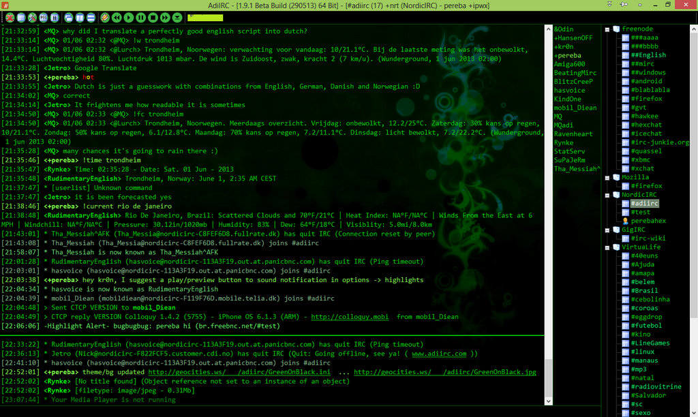
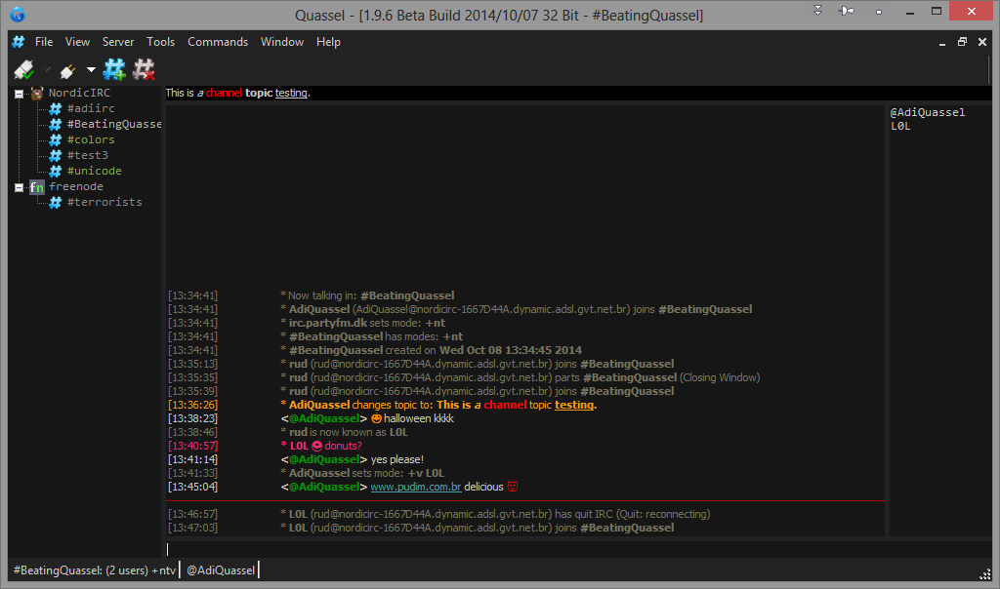
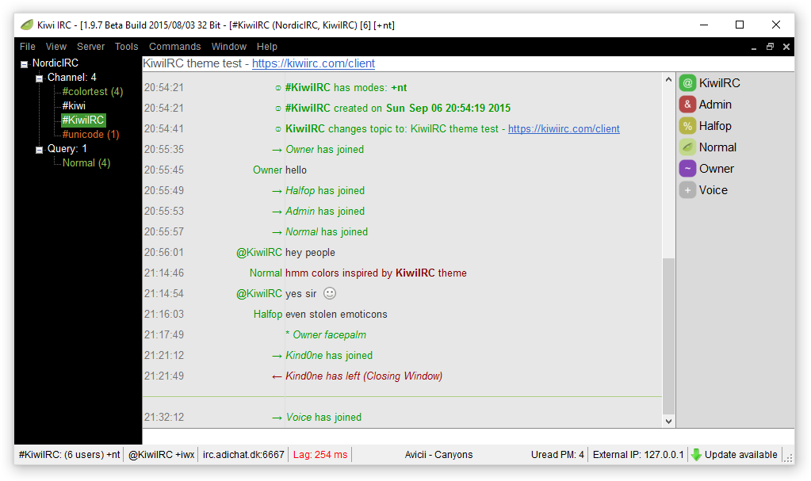
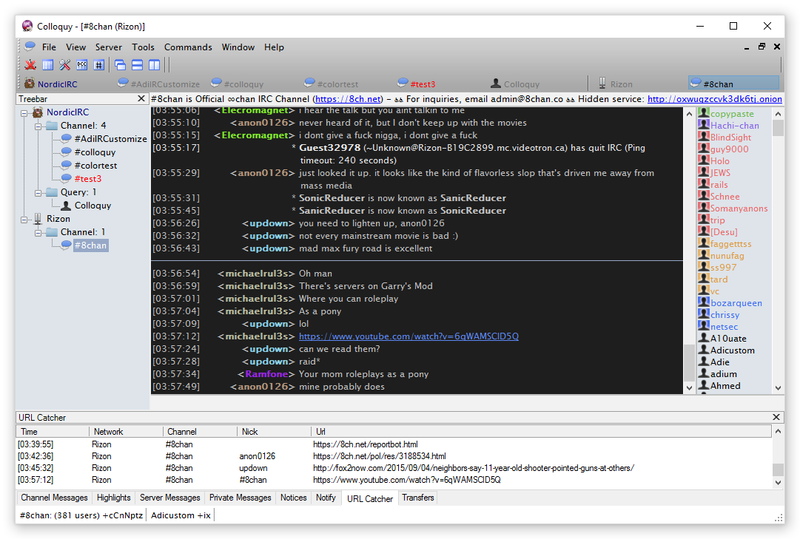
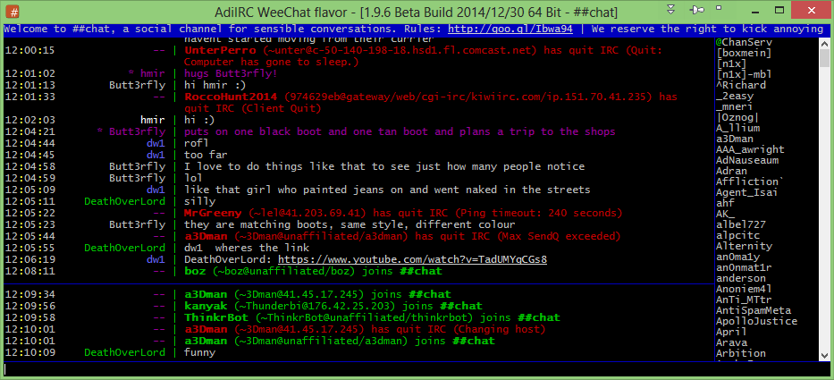

<!--  Notes:
* Heading anchors work. Wishlist: Automatically name headings as anchor points.
* Quick Links don't take up as much vertical space as they would as bulleted lists.
* I need to add a bulleted list of basic (comparative) vitals for each client.
* !!! Floating md image seems nnot to work. I put in a regular img html tag. :(
* I chose 256p logo, would like to do all clients.
-->

<!--div style="text-align: right"-->

 <!-- margin: 0px 15px 15px 0px; -->
<!--XXX  -->

# AdiIRC

<blockquote class="fancyquote">

I was without internet for 3 months, got bored and created my own irc client.
Creating an IRC client without internet was probably not my brightest hour. :P
<cite>Kr0n</cite>

</blockquote>

<!-- Block quotes in giant, centered, italicized block.
     With -Kr0n right-aligned beneath it. -->

## Quick Links
**On This Page:**
[Screenshots](#screenshots) |
[About AdiIRC](#about_adiirc) |
[Features](#features) |
[Scripting](#scripting) |
[Themes](#themes)

**External Sites:**
[Website](https://adiirc.com/) |
[Download](https://adiirc.com/download.php) |
[Change Log](https://adiirc.com/notes.php) | <!-- Version History,Release Notes -->
[FAQ](https://adiirc.com/support.php?p=4) |
[Development](https://dev.adiirc.com/projects/adiirc) |
[Issues](https://dev.adiirc.com/projects/adiirc/issues) |
[Wiki](https://dev.adiirc.com/projects/adiirc/wiki/) |
[Forums](https://dev.adiirc.com/projects/adiirc/boards) |
[Screenshots](https://dev.adiirc.com/boards/6/topics/195) |
[Wine Support](https://dev.adiirc.com/projects/adiirc/wiki/Wine) |
[Contact](https://dev.adiirc.com/projects/adiirc/wiki/contact)

**IRC Channels:**
[#AdiIRC](irc://chat.freenode.net/#adiirc) on [freenode](#) (official) |
[#AdiIRC](irc://irc.nordicirc.com/#adiirc) on [NordicIRC](#) |
[#AdiIRC](irc://irc.rizon.net/#adiirc) on [Rizon](#) |
[#AdiIRC](irc://irc.​electrocode.​net/#adiirc) on [ElectroCode](#) | [(more)](https://dev.adiirc.com/projects/adiirc/wiki/IRC_Channels)

## Screenshots {#screenshots}

<!-- We need an auto-thumbnailer.  Until then, broadband... -->
<!-- style referenced from
  https://stackoverflow.com/questions/787839/resize-image-proportionally-with-css/8839678#8839678 -->

## About AdiIRC {#about_adiirc}

AdiIRC was first publicly released on January 07, 2016, and is presently in
active development.  It is a closed-source freeware IRC client for Windows,
modeled after the popular [mIRC](mirc) client, and written in C# (C-Sharp).
Compatible with Windows XP and later, and runs fine in Wine for Linux and
MacOS.  ~~AdiIRC is supported by donations.~~  The author, Per Amundsen, no
longer accepts monetary gain, but you could hire him at your Fortune 500
company! &Hat;&lowbar;&Hat;

> Q: What does "Adi" stands for?  
> A: Nothing really. It's an old prefix used for some other projects many years
  ago, and the prefix just carried over to this IRC client. Original it was
  derived from the song A.D.I.D.A.S by the band KoRn. According to some it could
  stand for "All Day I IRC" :P - Kr0n

## Features {#features}

Some of the features AdiIRC boasts include; [Scripting](#scripting) support with
sophisticated debugging, an advanced [Theming](#theming) engine, Spell checker,
Language translations, IRCv3 compatibility, advanced server/network database,
SASL / Services support, Regular expression search, and of course Emoticons. ;)

## Scripting {#scripting}

AdiIRC supports a variant of the [mIRC Scripting Language](#) (mSL), with its
own additions and deviations from the official mIRC supported script.  Some
features and syntactic behaviors may not work as expected, but the developer is
fairly responsive to bug reports and suggestions for improvement.
In particular, AdiIRC offers scriptable access to Windows APIs so you can poll
system information, access media players ("now playing"), and really customize
the client's look and feel with highly refined theming.

The developer hosts his own [paste bin](https://kr0n.dk/) for use in the
[#AdiIRC](irc://chat.freenode.net/#adiirc) support channel.

## Themes {#themes}

(Write something about themes; glamorous and technical.) The screenshots on this
page demonstrate how AdiIRC can be customized to look like any other IRC client.
Just about every element of the client can be modified, including the color and
layout of all text, dockable panels, icons, menus and anything else.

---
Last revised on 26 August 2016
&mdash; [Hey, you can edit this page!
](/clients/cross/hexchat.html)

<!-- Last modified -->
<!-- [You can edit this page!](github/wio link to file) -->
