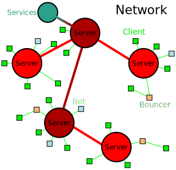

<style type="text/css">
<!--
.small p { font-size:x-small; line-height:2ex;  }
-->
</style>

> **Note:** <br>
> this is a reconstruction.<br>
> source at: <br>
> http://www.ibiblio.org/ [Collegiality-in-Cyberspace.txt][1] <br>
> old-wio [academic-vincent-c-collegiality-1993.doc][2] <br>
{:.small}

[1]: http://www.ibiblio.org/pub/academic/communications/papers/irc/Collegiality-in-Cyberspace.txt
[2]: https://github.com/irchelp/old-wio/raw/master/htdocs/irchelp/communication-research/academic/academic-vincent-c-collegiality-1993.doc



TODO
* convert the doc file
* figure three Individual spreadsheet for card game
* Figure four The social communication group
* Figure five  The IRC communication group
* Figure six  new infrastructures for collegiality



Collegiality in Cyberspace<br>
 case studies in computer<br>
 mediated  communication<br>
<br>
by<br>
Cheryl Vincent<br>
B.A. <br>
Department of Sociology<br>
<br>
Submitted in fulfilment of the requirements<br>
for the degree of<br>
Master of Social Sciences (Sociology)<br>
University of Tasmania, November 1992<br>

This thesis contains no material which has been accepted for the award of any
other higher degree or graduate diploma in any other tertiary institution.  To
the best of my knowledge and belief, the thesis contains no material previously
published or written by another person, except when due reference is made in
the text.

This thesis would have not have been completed  without the support and
collegiality of my fellow Master of Social Science and Graduate Diploma of
Social Science students, who have helped with ideas, the Murder game and
editing.  I would especially like to thank Richard Volpato for his invaluable
ideas and encouragement in not only getting this thesis off the ground but
completed as well.  I would like to thank Matthew Burbury and Kylie Murphy for
their ideas  and help in the Card and Murder games, Janet Woolley for her
editing skills as well as Justin Ridge (Computing Centre, University of
Tasmania),  and the many Internet Relay Chat (IRC) users who have given
resourceful and often needed technical advice on IRC.   Finally, appreciation
must also be given to all  those individuals from the University of Melbourne
and the University of Tasmania who participated in the case studies presented
in this thesis for their time and valuable information.

# Executive Summary

Living in an information society changes the nature of social contact between
individuals. With advances in computer mediated communication those who engage
in research have the opportunity, to not only communicate with those who have
similar _research interests_, but are able to  collaborate with others  in
dispersed locations as well.

Inter Relay Chat (IRC) is a synchronous computer conferencing system that
allows individuals to communicate with others in real time.  This type of
communication overcomes the barriers of time and distance.  Since IRC allows
individuals to communicate over dispersed distances collaboration is able to
take place between individuals who have never met and who may never meet   IRC
then is a computer mediated communication system that is consistent with the
collegial form.

Four case studies were conducted to ascertain the effectiveness of IRC as a
communication system between collaborators.  The results of these case studies
show that although there were some operational problems with IRC, individuals
working in collaborative work groups were able to communicate with each other.
IRC has the ability to engender new collegial forms as well as supporting
_classical collegiality_.

As collaborative work groups develop an _in house_ knowledge (that requires
some type of study) a code develops to provide group closure.  These groups are
proto collegial.  Neo collegial work groups have a theoretical knowledge base,
plus a commitment to the processes of work.  They engage in value added
activity around a commonly accessible object.  As collegial work groups engage
in value added activity such as interdisciplinary  collaboration they move away
from bureaucratic structures, becoming closer to neo collegial forms.

IRC allows individuals who want to  engage in collaboration to enter cyberspace
supported by a collegial form.


# Introduction

We live in an information rich society. There is a virtual explosion of
information and information systems that are altering the patterns of social
contact between people as well as individual roles.  Individuals, from
students, academics  to large  research corporations have discovered that the
only way they can survive now, and be ahead in the future is to understand that
information technology is advancing at great speeds and that they must _keep up
with it_.  Researchers worldwide, in universities or private research
facilities, recognise that their work effort is enhanced in a networked
environment where collaboration is available.

Collaboration amongst dispersed groups can be accomplished by  computer
mediated communication such as electronic mail and interactive conferences etc.
Communication via the computer network overcomes the constraints of time and
distance.  Through electronic mail and computer conferencing, researchers are
able to _talk_ directly with other  investigators  in the same, or related
fields.  Collaboration with others, with the support of computer technology has
the potential to change  the  nature of collegiality as defined in sociological
theory.

This new emphasis on _group rather that individual thinking_ in work
environments, whether it is in the research lab or in academic  collaboration
requires  a  type of computer mediated communication, that operates in ways
that are consistent with the collegial structure of the work groups that are
now emerging.

Internet Relay Chat (IRC) is a synchronous computer conferencing system which
is consistent with the collegial form.  This thesis looks at several case
studies that use Internet Relay Chat as a medium of communication between
individuals and work groups.  These studies were designed to ascertain
communication effectiveness using IRC and what effect this type of
communication has on the development or support of collegiality within
collaborative work groups.


## 1.1 Computer Mediated Communication

Computer mediated communication (CMC) allows individuals who are connected to a
computer network to communicate with each other over time and distance.

You have at your fingertips the ability to talk in _real time_ with someone in
Japan, send a 2,000-word short story to a group of people who will critique it
for the sheer pleasure of doing so, see if a Macintosh sitting in a lab in
Canada is turned on, and find out if someone happens to be sitting in front of
their computer (logged on) in Australia, all inside of thirty minutes.  No
airline (or tardis for that matter) could ever match that travel itinerary.
(Kehoe:1992:5)

Computer mediated communication has many advantages.  Robertson (1991) has
outlined the following:

> Speed.  One of the major benefits of CMC is speed.  A message sent via
> computer will arrive at its destination, whether local or overseas often
> within minutes of being dispatched.   This form of communication is more
> efficient than sending messages through the regular postal service which
> can in some cases, depending on the overseas destination, take up to a week
> to reach the receiver.  Faxing messages can also take time if the line is
> busy or if the facsimile machine is not located near the sender.  Computer
> mail can be sent from one terminal to another. Both the sender and receiver
> do not have to leave their desk to either send or receive messages.

> Dispersed communication. Using CMC as a method of communication means that
> individuals from many dispersed places are able to communicate with each
> other via a computer network.  Distance is no longer  an issue.
> Individuals who have never met in person or who may not have the
> opportunity to meet, can communicate and collaborate on
> specific work projects or share their expertise in particular areas.

> Synchronous communication.  Individuals from all over the world are able to
> _talk_ to each other in _real time_ through CMC.  With this type of
> communication, issues of time or distance between those who wish to
> communicate are addressed in an efficient manner.

> Asynchronous communication.  CMC can also be asynchronous providing a means
> of communication across time barriers.  With  communication systems such as
> electronic mail (E-mail) the sender does not have to rely on the recipient
> being free to receive and attend to the message as soon as it arrives.  The
> message will stay in the recipients mail box until they attend to it.  This
> type of system is essential especially when communicating overseas where
> some time differences are unavoidable.

> Anonymity.  Most CMC allow anonymity between users.  Since those who use
> computer mediated communication cannot see each other face-to-face, they are
> able to take on an alias to hide their identifies if this is what they want
> or if it is required for some reason.  For instance some computer
> conferencing systems make use of anonymity e.g. Internet Relay Chat.

Not all CMC systems are the same.  In most instances there is usually a
computer mediated communication system or systems that will fill the needs of
different individuals and corporations. Below is a few of the most common or
popular ways of using computers to communicate with others.


## 1.2 Electronic Newsgroups

Electronic Newsgroups  are online discussion groups that allow  dispersed
individuals to communicate with each other on a variety of  topics that
interest them.  There are over 2000 news groups on the Network and they range
from such diverse issues as Astrology, Folk dancing, Hypertext and Virtual
reality!

By having such distinct names each news group is able to have a  highly focused
discourse on the specified topic.  Once individuals have found those news
groups that hold specific interest to them or meet particular demands, they are
able to select those groups and read the articles posted within them.
Individuals are able to see  new  postings,  responses made by other
individuals

Individuals are able to respond to particular articles posted by other users,
as well as  making additional comments themselves.  This can be done  by either
posting an article of their own  to the news group, or by responding directly
to the author of the article in question via the electronic mail system.

Individuals are able to subscribe and unsubscribe to particular news groups
whenever they wish. News groups can be accessed by using different applications
such as Newswatcher (a Macintosh application).

## 1.3 Bulletin Board Systems

Electronic Bulletin Board Systems (BBS) are used as discussion  symposiums
where individuals from all over the world can   _discuss_ issues of interest
usually on a particular subject.  Those who use bulletin boards do so for a
variety of purposes which include some of the following:

> Requests for information. By using the bulletin board individuals are able
> to increase  their information resources to include those  of other group
> members.   This could be of  help to individuals in areas of research,
> study or  because they have an interest in this particular area and would
> like to know more.

> Problem solving.   A problem can be thrown open for discussion amongst all
> those interested and an electronic brainstorming session of sorts could
> ensue.

In this way collegiate groups form, in  which  like-minded  individuals  can
help  each  other  on  a particular problem solving task.  The benefit of this
communication system is that it is asynchronous.  Individuals can look at the
board at any time and contribute possible solutions at a time that is best
suited to them.

> Provide advice or  knowledge.   The discussions on BBS are always alive and
> continuous regardless of the time of day or where individual members
> reside.  Since each subject area is continuously updated, each time the
> user logs onto the system they have access to current knowledge on  that
> particular subject, or related areas.

People who subscribe to the BBS can either be passive readers or active
contributors to the discussion at hand.  Interaction in most cases occur
amongst individuals who have never met. This provides a network of information
amongst individuals who have things in common on a dispersed level.


## 1.4 Electronic Mail

Electronic Mail or E-mail is both quick and asynchronous.  _A computer based
mail system fills the gap that exists between written communication by letter
and spoken communication by telephone_ (Postel:1988:64).  As well as sending
memorandums or letters, data files can be sent from  one individual to another
via the E-mail system already in computer format, ready to be viewed upon
receipt.   Multiple copies of the message or file  can be sent to different
users at the same time from the same posting.

> Asynchronous communication.  Since E-mail is asynchronous it does not depend
> on the receiver being immediately on hand to receive the message.  Messages
> received are kept in the recipient's mailbox until the next time they check
> their mail.  E-mail messages can be read, saved into a particular file or
> computer disc, printed out  or responded to at the receivers leisure.

This type of communication has advantages over telephone conversations as it is
sometimes difficult to contact a person at the time wanted.  A lot of time can
be wasted searching for a person to accept a telephone message.  Messages left
with others,  can be difficult for the recipient to understand because some
important pieces of information may  have been lost in the transcription.

> Aliases.  Those individuals who use E-mail on a regular basis and  write to
> the same addresses are able to define an alias for different recipients. In
> this way they do not have to spend time typing in many E-mail addresses or
> having to remember difficult ones.  This is useful if the author wants to
> send multiple copies of a message to different people.

There are some limitations to E-mail which include the following:

* Delays in response.  If the message is urgent and the recipient does not log
  on to the system and  check their mail box, some mail may not be read and
  responded to quickly.

* Certainty of receipt.  Senders cannot be  sure if their message got through
  if the recipient does not respond to the message received.

New mail systems  have done much to alleviate these problems by having chimes
that let the receiver know that they have just received a message e.g.
QuickMail  (by Macintosh).   The type of chime can also tell the  receiver what
type of message has been received e.g. urgent.   Some mail systems have a built
in   feature that allows the sender to know if and when the recipient has
received the message sent.


## 1.5 Computer Conferencing

Computer conferencing offers many benefits that support communication within
groups.   Some systems are designed to be synchronous while the majority are
asynchronous.

> Communication takes place through a computer terminal by typing and reading.
> Both cognitive and social emotional exchanges tend to be different that
> face-to-face communication. Communication  is  asynchronous;  sending and
> receiving may occur seconds apart, or days or even years apart.  The computer
> stores information, allowing retrieval by attributes such as topic.  The user
> can also filter communications, deciding  whether,  when  and  how thoroughly
> to choose to read items from the mass of accessible material.  (Hitzt in
> McConnell:1989:191)

According to Rapaport (1991) computer conferencing had its origins in 1971 when
the office of Emergency Preparedness (OEP) commissioned Murray Turoff to
develop a computer system that was analogous to the existing voice conference.
Since the development of EMISARI (the Emergency Management Information and
Reference System) which was the prototype of more recent computer conferencing
systems, many conferencing structures have been developed to suit the needs of
different groups.

There have been many experiments using computer conferencing systems.  Below is
a case study conducted by McConnell (1989) that looks at an asynchronous mode
of conferencing using a computer.


## 1.6  CMC in education (McConnell's Study)

McConnell (1989) conducted a case study amongst a group of professional
teachers taking a MEd in Service Education.  He used the CoSy (asynchronous)
conferencing system as part of his study to ascertain usage patterns and
perceptions of computer conferencing in education.

> The general aim of the trial was to examine the introduction of a
> sophisticated, computer based electronic teaching and learning medium into a
> conventional on-campus postgraduate degree course whose students were, on the
> whole _ordinary_ non computer literate people. McConnell (1989:191)

The overall reaction to this form of computer mediated communication was mixed.
McConnell reported the following types of statements from participants.

* Good
* Easy to use
* Great fun
* Frustrating to use
* Time wasting

A key finding was the _social presence_ of the group.

> Social presence can be characterised by such attributes as feeling close to
> other participants in a meeting, the level of anxiety during the meeting; the
> amount of interaction and so on. (McConnell:1989:194)

Feelings of satisfaction were high while feelings of anxiety were low amongst
participants  during conference exchanges.  Many _shy_ students felt more
comfortable communicating with this computer medium because they perceived that
they had an opportunity of participating more fully in meetings. In
face-to-face meetings they would not have had the same level of participation.

There were many students however who reported that they did not feel close to
other conference participants.   Individuals felt that during conference
sessions there was a great deal of formality as compared to face-to-face
communication processes, and student-to-student interaction was perceived as
being low.

The results of this study outlined five main factors that limited the use of
this computer conferencing system.

* Time.  There was a lack of time in becoming familiar with the system so that
  it could be used effectively as a part of study activities.

* Reading messages.  Many of the students in this case study found that the
  conference messages were difficult to read because they did not have access
  to a hard copy of the conference session or a scrolling facility on the
  computers that they used.  This discouraged use of computer conferencing
  despite the reread facility built into the system.

* Conference length.  The mass of information (continually building up over
  time) was another factor that limited use of this conference facility.  If
  there were a number of messages sent to the system that were  lengthy, then
  students had to deal with trying to assimilate at times, vast amounts of
  information.  This was true if the time between computer logons was of an
  extended period.

* Access to computers/terminals.  Participants of this case study found that
  the computer facilities available to them were not adequate for their needs.
  These individuals were reluctant to use other computer facilities elsewhere
  on campus, away from direct support.

* Note taking.  Since there was no hard copy of the conference available
  students had to take notes of the important pieces of information that they
  wanted to remember.  Having to take notes became irritating.

The factors limiting the use of this computer conferencing  medium may not be
as noticeable if a different conferencing system was used. Not all computer
conferencing systems are asynchronous.  Synchronous communication allows
individuals to communicate in a different conference format.

Internet Relay Chat (IRC) (described in the next chapter) is one system that
allows individuals to communicate with each other in real time, logs from
sessions can also be kept for later reference.  Computer conferencing via IRC,
with the support of other computer mediated communication systems such as
E-mail (an asynchronous computer medium), if used in collaborative work groups,
may be a way of allowing all members  to be equal  participants  in
discussions  dealing with both the product and the process of work within the
group to which they belong.  However one must ask the question of how CMC or
IRC in particular, will affect individual involvement with, commitment to, and
perception of, their work colleagues.


## 2.1 Internet Relay Chat (IRC)

Reid (1991:8) states that;

_IRC is a multi-user synchronous communications system. It allows people to
chose which person or group of people they wish to see the activity of and to
whom they wish their own activity to be transmitted_.

> Jarkko Oikarinen wrote the program in 1988  and it  is based on a client
> server model. (Pioch:1992).

> Servers.  A number of servers are linked together to form the IRC network.
> Servers transmit various types of information between themselves to keep each
> other up to date.  _Think of a server as being a bank... there is one in each
> local geographical area, which will constantly update the main bank records
> of any changes and receive updates made by other branches_. (Ridge:1992:4)

> Clients.  A Client is used to  connect the  IRC user to the network. All
> clients in a particular area i.e. Hobart Tasmania will connect to their local
> server.  In this case  irchat.utas.edu.au located at the University of
> Tasmania's Computing Centre. _Think of a client as being similar to a bank
> customer. The customer communicates with the local branch (i.e. the server)
> and receives information such as account balances which are relevant to
> him/her_. (Ridge:1992:4)

Ridge (1992) has designed the following model to demonstrate how the IRC
network here at the university of Tasmania is linked to various parts of the
world.



Figure one: Simplified map of IRC

Communication using IRC relies on the written word.  It is synchronous in that
messages are typed, transmitted, received and in most cases responded to within
the same time frame in which verbal communication would take place.

IRC does not rely on  physical contact between users at anytime during the
communication process.  Most individuals who use IRC on a regular basis would
only know a very small number of other IRC users in person, or have any
physical contact with other users who do not live specifically in their own
local area.

One of the benefits of IRC is that it allows communication between individuals
who have never met and who are not likely to meet, to share ideas, customs and
other information about each other.  It also allows individuals from dispersed
locations, who have common interests or who are working on similar projects to
collaborate with each other in a synchronous format regardless of  time or
distance.

IRC is not operated at any particular headquarters or by any particular
organisation (it is not an official program).  It is a collection of servers
mutually updating each other through links.

Most IRC users are students or individuals, who as part of their employment,
have access to Internet via a computer or terminal.

IRC is maintained by individuals who have chosen to spend their own time in
many cases to set up, or maintain IRC for the benefit of local users.  IRC was
set up at the University of Tasmania on a _semi-official_ basis in order to aid
research in computer mediated communication.

Ridge (1992) has made the comparison between IRC and a CB Radio/telephone
combined.  He has noted that while users of CB radio use a call sign as a means
of identifying themselves to other users, those who use IRC have nicknames to
identify each other.   No real names are used on IRC so nicknames are utialised
to identify particular individuals, this is to provide anonymity.  Information
such as real names can be part of the user's location/E-mail address e.g.
u883449@bruny.cc.utas.edu.au (Cheryl Anne Vincent), which anyone on the IRC
system can view if they wish.

Once on the IRC network individuals are able to send and receive messages.
Ridge (1992) used the metaphor of a telephone because once on IRC it is
possible to send a message directly to a particular computer. In the IRC
environment this is called a private message and is only received by one person
to whom the message is intended, no one else on the IRC network sees this
message.

In order to participate in a public discussion with other IRC users it is
necessary to create a forum for this to happen, or to join an already existing
discussion. This is done by the use of channels.  A _channel_ in this case is
analogous to that used by  a CB radio  in which individuals are able to see all
the activity (discussion) that is going on within the channel and can
contribute messages  of their own.

In order to control one's environment once in the IRC network simple commands
are executed that allow the user to do particular things e.g.

* `/msg <nick> message` - sends a private message to the designated person.

* `/join #<channel name>` - allows the user to join a particular channel or to create one of their own.

* `/mode #<channel name> +i` - makes the channel invite only so that those
  users who wish to join this channel have to be invited by someone who has
  channel operator status.

## 2.2 Uses of IRC

Mulry (1992) has outlined some of the uses of IRC which consist of the following:

* Communication between two or more individuals in real time. Individuals can
  either send private messages to each other or can take part in public
  discussions on  channels.  IRC users from many dispersed places are able to
  talk to each other regardless of time or distance.

* Conferences.  These can be open or restricted depending on how the conference
  forum (in this case channel) is manipulated.  For instance if a group of
  individuals wished to participate in a private conference the channel
  operator (the individual who created the  channel  or  an  individual  who
  has  been granted operator status) can make the channel private so that it
  does not appear in the list of IRC channels.   They can also make the channel
  invite only, allowing only those users who have been specifically invited to
  the channel to join it.

* High speed file exchanges.  Any information that can be put into a data file
  can be transferred through the medium of IRC. This includes both text and
  graphics.

* Access to specific services while using IRC via robots/service.  IRC robots
  are clients that have been automated to react in particular ways within the
  IRC environment.  For example Noteserv is a robot/service that allows IRC
  users to leave a short note for other users, who are not currently logged on
  to IRC.  Individuals who have notes left for them on Noteserv will
  automatically be notified of this the next time they logon to IRC.

## 2.3 Access to IRC

IRC  is a  text based  interface  that  can  be  accessed  from any computer or
terminal that has a connection to the Network.


The IRC screen

The IRC screen (as viewed on a Macintosh computer) looks like the following:


Figure two IRC screen

The above figure shows a typical screen during an IRC session.   Trim and
Lindahl (1990:5) state that _Chat [IRC] is a full screen utility.  It takes
over the screen....  Almost everything happens in the upper bulk of the screen.
This includes both messages from other users, as well as the output of the
control commands_.

As each person sends a message to the channel, the computer screen scrolls to
incorporate this new dialogue.  Old messages once they have left the screen are
lost from view, but can be recaptured if the user issues a command to scroll
back through the discussion or keeps a log of the session.

Public messages from individuals participating in a IRC discussion appear
within the channel with the originating nickname in \<angle brackets\> e.g.

```
    <Legend> now you have direction you r an op
```

Private messages are sent to the recipients screen with the originating
nickname in \*asterisks\* e.g. if the message sent by legend was a private one it
would look like this;

```
    *legend* now you have direction you r an op
```

When an individual sends a private message to another user their name appears
in asterisks proceeding the message they have sent as well.

All control commands can be seen on the screen by the channel participants e.g.

All those individuals on channel #Liahona would see the following command:

```
	***mode change wigg on channel #Liahona by Liahona.
```

This particular command shows that wigg has been granted channel operator
status (able to manipulate the status of the channel i.e. making it invite
only, private, secret etc.) on  channel #Liahona by Liahona.

The black line at the bottom of the screen carries information such as the  IRC
user's nickname, what channel (if any) they are on and the status of that
channel, e.g. Liahona is on channel #Liahona and the status of that channel is
invite only (+i).  Information such as the time of day may also appear on this
line.

All the messages sent to the screen by Liahona are typed in the bottom line of
the screen next to the channel name e.g.

```
	#Liahona:  once the projects finished less stress!!! :)
```

This line scrolls as the message is typed in.  There is a limit to the length
of each message once the limit has been reached the IRC user must use the
carriage return to continue with any unfinished dialogue.

Although many  dispersed individuals  enjoy using IRC as  a medium of social
communication, how effective is it as a communication system?  How does
communication via IRC differ from face to face communication and how do
individuals adapt to communicating in this way?

In order to ascertain the benefits of using IRC as a major means of
communication between individuals, the following two games were _played_.  IRC
logs for each game session were kept and analysed. Individuals who participated
in the How to Host a Murder  role play were asked to submit written comments on
their perceptions of IRC and its communication effectiveness.


## 2.4 How to Host a Murder

The objective of this game  was to determine how effective computers are for
communication.  Can individuals actually get the messages that they want to
over the computer without the aid of other methods of communication i.e. non
verbal cues.

Areas of specific interest were:

* Individual perceptions on the efficiency of IRC as a means of conveying information between people in a setting where information content is important.

* The difference between IRC and face-to-face communication.

### The game

How to Host a Murder is an adult detective game.  These games have  particular
settings i.e. country mansion, archeological dig etc. The players all take on a
role as a _murder suspect_ whose objective is to discover who the murderer is
without incriminating themselves (if in fact they are the murderer).  The game
is played in rounds, during which each participant must disclose specific
pieces of information about other players.  Players may ask other _suspects_
any questions they wish in order to get them to disclose any incriminating
evidence.   A separate individual acts as the game facilitator who controls the
game setting and makes sure that particular players reveal specific information
in each of the  rounds e.g. suspect one reveals the contents of a will in round
two etc.

The game players, by paying attention to the information given out during the
role play  should be able to _guess_ who the real murderer(s) is (if it is not
themselves).

There is four rounds to the game at the end of which the facilitator asks each
suspect to reveal who they suspect committed the crime.

### Game participants

The participants of this IRC role play consisted of nine individuals aged
between 23 and 33 enrolled in the Master of Social Science degree at the
University of Tasmania.  All game participants knew each other well.  Eight
individuals   played the part of guests at a country mansion.  The ninth person
acted as the game facilitator to make sure that all the rules of the role play
were adhered to and that guests divulged the required information at the
appropriate time.

### Overview of the game

Most individuals loved playing the game and thought that it was fun, although
trying to communicate in this way proved to be a challenge.  Some of the
players felt a little disadvantaged because of inefficient typing skills or
because they were unfamiliar with the IRC program itself.  Some individuals
indicated that it was hard for them to keep up with  all  the information that
was on the screen at one time.  Others indicated that they had to concentrate
when typing messages  because  they knew that they  had to give out vital
information and wanted to make sure that they did this right.

As the game progressed most individuals became accustomed to the IRC program
and the scrolling effect of the screen and   _got into_ the game more in terms
of the characters they played. Many of those individuals who  had trouble
assimilating all the information presented to them on the screen tended to
adopt strategies to overcome problems with this, such as only attending to
information that they thought was pertinent to them.

As familiarity with IRC increased the individuals who participated in this role
play found that they could communicate via this computer medium.  Individuals
managed to guess who the assassin was as a result of playing the role game even
with the limitations of IRC.

### Initial reaction to the game and IRC

Initial reaction to the IRC environment in the context of playing this game was
enthusiastic and this positive attitude stayed throughout the game.  The
following comments are typical of those given by game participants:

_It was fun and exiting, particularly as it was more difficult to predict how
people were going to react... as we could not see peoples non verbal
communication.  My  first time typing on IRC and I can understand the
addiction. Even before the game started I was enjoying the freedom of
anonymity, as Rog, to carry on an affair with Lady Flo.  That loosening of
inhibitions, the FLAME EFFECT (emphasising message by  putting it in capitals
similar to shouting in verbal communication.) that you see on BBS and E-mail
systems is critical to the utility of on-line systems.  There are no
obligations, conventions or barriers in this mode of communication. You can
talk when and if you  want and to whoever  you like_.

_Having only used IRC once before it was easy to pick up the general gist of
how IRC worked (i.e. channels etc.) It was an interesting and challenging way
to communicate with people, especially  communicating in a way that means you
have to concentrate on what others were saying and also try to solve something
at the same time. It made you think about what you were going to say because it
would effect other peoples comments. This would be different than simply
talking to people via IRC simply as a means of discussion_.

### Communicative effectiveness

Most of the participants in this role play stated that they had  problems
communicating with others using IRC as a communication medium.   Most of these
problems were due to poor typing skills and unfamiliarity with the IRC program.
Protocols used between individuals in social communication were absent as well,
mostly due to the lack of  non verbal cues that are exchanged in  face-to-face
communication encounters. Inefficient typing skills was a problem mentioned by
a few individuals that effected the communication process.

_it is essential to be able to touch type_.

_If you are like me and cannot type very fast or accurately, you tended to
concentrate on what you were saying and lose what the others were typing.  The
advantage is that you could always read the log but I think quite a few clues
were lost in this way, more so than if you had heard it spoken to the group.
However you did have the advantage that you could more readily ignore or
deflect a person's line of questioning more readily than if they were harassing
you vocally_.

Communication problems occurred because some participants were so busy trying
to get the messages they had to reveal on to the screen to  take note of what
other people are saying.  This problem does not occur as often, when
conversations on IRC are between small groups of people.

When discussion groups contain more than five individuals, trying to
communicate (especially when the information content of each message is high)
problems  can occur in keeping up with discussions or understanding messages.
Some individuals adopted strategies to help overcome this problem. One
individual explains how he managed with this situation:

_Cocktail party syndrome. The script should show that people came to be able to
focus on single separate streams of the screen conversation.  I skipped  most
of the stuff about Randy's past, whereas Donny would have very specifically
scanned those lines, ignoring other streams. We picked  what interested us and
ran with it.  By skimming what was not essential we learned how to read IRC.
We adapted to losing all our non verbal channels of communication everything
was made textually explicit I suspect more content came out this way than
otherwise would. Anyway the ability to scroll back on speech helped  immensely
to being able to think things over and respond fully_.

The scrolling effect of the screen seemed to hinder the communication process
to some extent for those individuals who were not familiar with this concept.
One individual commented that _The scrolling effect of the game, that is the
page on the screen scrolls up every input, causing one to consider only playing
minimally since to lag behind means missing vital information_.

This can cause considerable problems for those who are new to the IRC
environment especially if there is a great deal of activity on the channel
where discussion is taking place.   This makes it  hard for those who are
unfamiliar or slower to keep up with all that is going on.  Familiarity with
IRC comes  with continued use of the system, as with many things _practice
makes perfect_.  Individuals who intend to use IRC for conferencing purposes
should be encouraged to _play_ with the system so that they become more
familiar with the technology and the protocols that govern it (see appendix one
for sample of the log for this role play).

In face-to-face communication there are particular _rules_ that govern social
behaviour.  For instance  it is not _polite_ to interrupt the flow of
conversation by _jumping in_ with comments of one's own.  Many of the protocols
that govern social behaviour during the communication process are transmitted
via non verbal cues.  Usually when an individual has finished speaking their
voice rises or when an individual wishes to speak they will lean towards the
person to whom the conversation is directed.

Since communication via IRC relies wholly, on written words the conventions
that regulate face-to-face conversations are absent.

As a result discussions on IRC can become hard to understand because
individuals can interrupt dialogue or flood the screen with  information
accidentally, in the absence of non verbal cues.   More structured
conversations with a moderator or chairperson might help with this issue, when
individuals or groups wish to use IRC for conferencing purposes.

Individuals found that using IRC  was a good way to teach the idea of focussing
on a particular problem.  Since  concentration is required to keep up with the
flow of information (especially in this conference format) this method could
teach individuals how to focus their attention as well as how to focus their
communication of a specific topic in order to be able to communicate in a clear
manner.

One of the role play participants commented  on the possible uses or IRC.

_A whole new world of doing things... breaking down the barriers of distance
etc.. widening your ability to communicate with a wide variety of people form
all over the world, with different perspectives._

Individuals once accustomed to IRC found that they could communicate well.
However competence aside, do individuals communicating via IRC follow the same
rules of protocol as those involved in face-to-face communication?


## 2.5 Who has what cards?

One of the objectives of  this card game was to determine how effective
individuals could communicate using computer mediated communication while
working on other tasks (on the computer) at the same time i.e. working on word
processing or graphics document.   The other point of this case study  was to
explore the _moral environment_ of IRC in regards to communication.


### The game

This game was designed by Matthew Burbury (a Master of Arts qualifying
student).    The individuals  were given a spreadsheet that looked like the
following example:


Figure three  Individual spreadsheet for card game

Each asterisk indicates what cards individual players had e.g. person Two has
the Ace of Clubs while person Three has the Ace of Spades.  This spreadsheet
was not to be printed out but left open in the background while individuals
communicated on IRC.

Game players had to switch from one window to the other to either check who had
what card, mark cards on the spreadsheet (after finding out who had what card)
or to ask someone  on IRC a question.

Players were also given specific instructions that they had to follow whilst
playing the game e.g. do not give out any information to person five, as well
as particular things they had to find out in order to answer bonus questions
e.g.  one player's hand totals 34, who has this hand?  The winner of the game
was the first person who could find out who had what card or who could answer
the  bonus questions first.

Players were able to use what ever strategies they liked to find out the
information they wanted but they had to abide by the instructions they were
given e.g. who they could _talk_ to and who they could not _talk_ to.  All
communication had to be via IRC, either public messages on the channel or by
sending private messages to individuals.

Each individual kept a log of the IRC session and these were collected at the
end of the game and analysed.  It was by analysing these logs that individual
communication behaviour could be observed. (see appendix two, sample of the
games log)

### IRC and multi-tasking

Some individuals had problems _coping_ with communicating on IRC and working on
an application in another window.  The main reason for  this  was  because
they  had  not used IRC before or were only recent users of the system.

Individuals overcame this to an extent by only attending to those messages that
they felt were pertinent to them.  While reviewing the logs for this IRC
session it could be seen that the further into the game individuals got the
less public messages they sent to the channel.  Individuals carried out most of
their conversations between certain other players.  Some players _teamed up_ on
an informal level to help each  other elicit the information they wanted from
other players.  For instance if person four tried to talk to person one and
person one did not respond to their enquiry, then person four would ask person
six to find out the information they wanted from person one. This was mostly
done in return for a _favour_ of sorts.

The difference between IRC and face-to-face communication

It seems that when there is an aura of anonymity people will act in a
particular way or say things that they would not normally say.  For instance
during the card game some individuals were not as _honest_ as they might have
been in face-to-face communication.  They not only  avoided giving out
particular pieces of information asked for but at times actually lied to those
who they were in communication with.

Some individuals in the card experiment were asked as part of their
instructions to not give out information to particular individuals, they were
successfully able to do this in most cases without telling the individual
concerned that they were not allowed to communicate with them.  Some game
players were able to manipulate other individuals in particular ways to get the
information that they wanted just through the use of words.  With face-to-face
communication individuals generally give away extra information about the words
they are saying by the non-verbal cues that they give e.g. sometimes it is
possible to ascertain if an individual is lying when they are confronted
face-to-face. With CMC all the  individuals  involved in the communication
process have to guide them is the written word.  A relationship of trust has to
be developed in order for this to be successful.  This trust at times was
abused by individuals in this game if they thought that they could _get away
with it_.

There were times when individuals would _stab_ their allies in the back to get
some information from someone else.  A sense of _morality_ normally associated
with face-to-face social interaction was wavered in this case because of
anonymity and because it was assumed that people could not be _found out_.
There were a few comments made by some of the participants of this game voicing
their discontent at perceived dishonesty amongst some of the games players.

IRC is an amoral system of communication.  The ensuing _morality_ of IRC is
dependent on the  users and the manipulation of others  that takes place in the
communication processes between individuals within the system.  Since Internet
Relay Chat is an informal chat system there are no official  _overseers_.
Sanctions for misbehaviour are in the hands of the individual IRC users
themselves.

In formal computer conferencing individuals are usually known to each other
(either by reputation or in person) and  anonymity is  reduced, as a result
breeches in established social protocols should not

happen as often. However, when individuals _chat_ with others, to whom they
have not met, on an informal basis,  they must take the risk that _things are
not always as they seem_.


## 2.6 IRC as a communication medium

IRC as a communication medium does have some limitations which include the following:


* The scrolling effect of the screen.  This makes it hard for some individuals
  (especially new IRC users) to keep up with the flow of information that is
  sent to the screen, particularly if there are more than five individuals
  _conversing_ at one time.

* Inefficient typing skills.  This limits the communication process to an
  extent because those individuals, who are slower at typing, tend to find
  keeping up with the conversations that are going on a challenge.  Because of
  the time some users spend concentrating on the messages that they wish to
  send to the screen, they sometimes miss other messages that have been
  displayed.

* Absence of non verbal cues to guide conversation.  As a result of this there
  is a lot of interruptions to conversations that  can make communicating by
  IRC hard to understand.

* Issues of _morality._  There are times that some IRC users  misrepresent
  themselves or the information that they give to others.  This is mostly
  because of the anonymity that IRC allows.  Some users behave on IRC in a
  different manner than what they would in face-to-face encounters because they
  perceive that they can _get away with it_.

Since IRC is primarily an informal _chat_ system many of these limitations
cannot be addressed except in formal communication encounters.  Those who wish
to use IRC as a means of communication to aid in collaborative work are able to
establish discussion forums where conferencing between colleagues is able to
take place.  Channels can be established and maintained by collegial groups in
which those who have interests in common or who are working on similar projects
are able to converse together in either a formal or informal basis.

Besides the benefits outlined by Mulry earlier in this chapter, e.g.
synchronous communication, high speed file exchange, access to services while
logged on the the system e.g. Noteserv,  IRC has some other advantages over
other conferencing systems (which are mostly asynchronous) these include;

* Time.  The time that is involved in becoming competent in using the system to
  communicate is relatively short.  Most of the participants  in the case
  studies just  presented managed to _master_ the basics of the system by the
  end of the respective games they participated in. The How to Host a Murder
  went for approximately two hour hours while the Who has what cards? was one
  hour in duration.

* Access to conference record.    Every IRC user is able to record a log of
  each session they participate in.  These logs can be read, saved and printed
  out as  occasions require.

* Conference length.   Since this is a synchronous form of computer
  conferencing communication happens in real time, there are no delays in
  response to issues raised.  The duration of each conference depends on the
  issues at hand or the individuals involved.

* IRC is _fun_.    One of the major benefits of IRC according to many of the
  individuals who participated in the games presented here as case studies is
  its informality.  This made IRC fun to use and experiment with.  Because IRC
  is perceived as _fun_  it allowed individuals to become familiar with a
  computer mediated communicating system.  Most of the individuals in these
  studies had never experienced communication in this way before participating
  in these games. They could _play_ and learn at the  same time.  This has
  major benefits for education since it allows _feelings of collegiality_ to
  develop not only amongst academics but students as well.  It may be possible
  in the future for students at  universities in many diverse places to
  collaborate together on major projects because it allows communication across
  distance and time.

Collaboration of this type could engender collegiality (as discussed in the
next chapter) amongst collaborative work groups as well as supporting classical
types of collegial forms.


## 3.1  Collaborative work groups

> Work groups comprise multiple individuals acting as a bounded whole in order
> to get something done.  So construed, they are inherently cooperative, where
> the term designates their requirement to coordinate the interdependent events
> to accomplish an acknowledged goal: it does not imply the absence of
> competition or conflict among group members.  A work group's purpose of goal,
> in turn may well involve a number of multi person tasks and task cycles: its
> activities are expected to persist over time and to survive membership
> changes. (Bikson, Eveland:1990:249)

Collaborative work groups vary in both form and purpose depending on the
organisation to which they are a part. These groups consist of individuals who
are dependent on each other in order to get the project done.  Resources such
as finance, knowledge and skill are combined to produce a specific product.
These groups are either permanent or temporary.

Robertson (1991) has outlined some specific work group characteristics.

* Permanent. These groups have a relatively permanent membership who typically
  engage in ongoing projects within the organisation to which they belong.
  Members normally work in close proximity and there is a high division of
  labour according to skills and output.

Individuals in these groups either work on long term projects or a series of
short term projects.  Communication within the group dwells more on the actual
work itself and less on how members will work together.  Formal work groups are
usually permanent.

* Temporary groups.   On the other hand temporary work groups are established
  for a particular purpose or task. Membership normally consists of individuals
  who would not ordinarily work together and who would separate after they have
  completed their assignment.  These groups allow organisations to respond to
  particular demands that occur within the organisation's environment in non
  routine ways.  The expertise needed for sustaining these groups are found
  from all areas within the corporation as need arises.

* Face to face.  These groups consist of members who meet together at the same
  time and place.  Their major means of communication is through discussion.
  They may meet to plan specific work projects including project design and
  work allocation, generate ideas through brainstorming sessions or reporting
  back on the project's progress and making necessary revisions etc.

* Dispersed.  These groups are separated by distance.  Group members are unable
  to hold face to face meetings due to the constraints of time or distance.
  These groups use information technology to communicate with each other which
  may include the telephone, Facsimile, Electronic-mail or Computer
  conferencing.

* Task orientated.  This type of group involves members who carry out
  particular tasks or work on  specific projects.  They can either be permanent
  or temporary depending on the nature of the task or project being carried
  out.

* Problem orientated.  These groups are temporary in nature and involve
  individuals who pool their resources to solve a particular problem through
  the means of discussion.  A brainstorming session is an example of this type
  of group structure and purpose.

## 3.2 Collegiality - the legacy

Theories of collegiality have their sociological roots in the works of Max
Weber in his discourse on Authority.  According to Weber there are certain
_important types_ that exist in relation to legal and traditional authority.
One of these types is the Collegial form.

> It is possible for any type of authority to be deprived of its monocratic
> character by the principle of collegiality. This may, however, occur in a
> variety of ways with varying significance. (Weber:1978:272)

Although Weber talks about Collegial forms, there is nowhere in his works that
he gives a clear description on what he views as collegiality.  As Waters
(1989:951) states, all Weber gives is _a list of 13 possible instances,
*types*, in which the collegial principle serves  to  divide the powers of a
monocratic chief  by placing limits and controls on these powers_.

Where Weber does talk about collegiality he postulates that it will decrease in
significance (especially in the political sphere).

> At the present time they are rapidly decreasing in importance in favour of
> types of organisation which are in fact, and for the most part formally as
> well subject to authority of a single head  for instance, the Collegial
> _governments_ in Prussia have long since given way to the monocratic
> _district president_.  The decisive factor in this development has been the
> need for rapid, clear decisions, free from the necessity of compromise
> between different opinions and also free of shifting majorities
> (Weber:1978:271-272)

> Waters argues that Weber predicted a retreat from collegiality because of
> advancing bureaucratisation, since it offers advantages in rapid decision
> making and efficient administration.  He states that one of the major
> opposing views of Weber's retreat from collegiality is Durkheim whose
> _utopian vision of the emergence of occupational corporations corresponds in
> some respects with a picture of collegial structure_. (Waters:1989:946)

> _The emergence of collegiality in non political contexts derives from the
> special form that the historical development of the professions took rather
> than from a structural imperative rationality_ (Waters:1989:957)

By citing Post Weberian theories on collegiality Waters has come up with a
formal statement of the Collegial principle that Weber himself failed to do;

> _Collegial structures are those in which there is dominant orientation to a
> consensus achieved between the members of a body of experts who are
> theoretically equal in their levels of expertise but who are specialised by
> area of expertise_.  (Waters:1989:956)

Waters gives six  ideal typical features of Collegial organisation.

### Theoretical knowledge.

_Collegiate organisation is arranged in terms of the use and application of
theoretical knowledge_ (Waters:1989:956). Knowledge is specialised in respect
to particular collegiate groups i.e. doctors and surgeons have a specialised
knowledge that deals with medicine and clinical practice.  This knowledge base
is complex and needs continuous advancement and maintenance in order to keep up
with the developing needs of those to whom they service.  For instance with the
outbreak of AIDS over the last decade medical science has had to find ways to
stop the spread of the disease, stall its progress, as well as come up with
possible cures.

This upgrading of specialist knowledge is vitally important because collegial
bodies are not only consumers of the knowledge they possess but are
disseminators of it, into the wider community as well.  Collegiate
organisations are formed to serve _clients_ who do not have this specialist
knowledge  and rely on members of the collegium as experts and distributors of
this knowledge in the form of information.


For instance, individuals who go to a doctor for a  medical diagnosis see the
doctor as an _expert_ who will be able to tell them what is wrong and how they
may receive treatment.  As a result of this responsibility to the public, there
are strict ethical norms that govern practise within collegiate bodies i.e.
doctors observe a strict code of confidentiality between themselves and their
patients.

### Professional Career

_Members of collegiate organisations are conceived of as professionals_.
(Waters:1989:957)  Professional careers are divided into two stages.

* Apprentice.  This is where the collegiate member internalises  those
  professional norms that govern the collegium as well as learning the
  professional skills associated with practice.

* Practitioner.  The transition from the apprentice to practitioner stage of
  the professional career is not _voluntary_ nor is the candidate appointed to
  this higher level.

They are elected into this position by those on the aspiring, or higher level.
i.e.  PhD's are not granted by other graduate students but by  collegiate
members in university faculties.  Volpato (1991:207) stated that _Knowledge is
a cognitive tool used, maintained and protected by a professionalised, perhaps
even a cloistered group.  Credentials provide the basis for membership_.

Another important characteristic of a professional career  is that of tenure.
Once an individual has received tenure within the organisation to which they
belong;

> it remains in place unless there is gross and obvious dereliction of duty or
> violation of ethical norms.  The granting of tenure implies that the person
> has been tested in the various stages of apprenticeship and found not to be
> wanting, and is therefore free from the _indignity_ of further tests or
> reviews. (Waters:1989:957)

### Formal Egalitarianism

> _Collegiate organisations are performance orientated systems.  For this
> reason it is extremely unlikely that any group of its members will be exactly
> equal in accomplishment and the prestige that attaches itself to it.
> However, precisely because members of collegiate organisations are
> specialists.  It is frequently difficult to compare performances_.
> (Waters:1989:957)

As a result these organisations are _formally equal_.

For instance one senior lecturer or tutor is  as formally equal as another
regardless of differing work performances.  Variability between member
performance, is the source of prestige-based stratification patterns found
amongst some groups in organisations or institutions to which these collegial
bodies belong.  Many such reputable organisations are able to attract greater
resources or talented recruits e.g. Medicine and Law (faculties), Harvard and
Oxford (universities).

### Formal Autonomy

Waters fourth ideal typical feature of collegial organisations  is formal
autonomy.  _Collegiate organisations are self controlling and self policing;
that is they are  not subject  to  direction  from any external source once
they have been constituted_. (Waters:1989:958) Formal autonomy comes in the
form of freedom of action and violation of ethical norms.

* Freedom of action in regards to the pursuit of professional goals.  In this
  way collegiate groups are free to do research, instruct others and
  communicate research findings in forums such as journals, text books etc.
  Performance standards are informal and differ from group to group but within
  all groups there is a minimum standard of performance that all members must
  adhere to.  Members must also follow those ethical norms established by the
  group.  For example some research by scientists because of its nature, is not
  allowed to be carried out on human subjects e.g. experimental drug therapy.

* Violation of ethical norms.  Sanctions for violation of these norms, except
  in the case of illegal activities,  are matters of self regulation within the
  collegium rather than outside influences i.e. bureaucratic or commercial
  interference.

### Scrutiny of product

_It follows that if a collegiate organisation is self policing and egalitarian,
then  there   must   be  maximum   stress  on   peer evaluation and informal
control_.  (Waters:1989:958) All work  products  by individual members of the
collegium must be available for review by peers e.g. consultations and second
opinions by those in medicine or written and oral dissemination of research by
colleagues in academia.

### Collective decision making

_Collective organisation implies the constitution of collective forums in which
decisions are made. The committee is the prototypical Collegial decision-making
body_. (Waters:1989:958)  There are three committee types:

* General committees. These involve all the members in a particular collegiate
  organisation e.g. academic board.

* Specialist committees. These committees comprise peers within a particular
  enclave e.g. faculty board.

* Delegative committees. These involve participants of work groups employed on
  particular projects e.g. policy-drafting. The members of these committees
  work for and are responsible to superior committees, for instance the
  academic board.

Committees within collegium are usually hierarchical in nature supposably
allowing for the equal participation by all _specialist members_.

Democratic voting procedures are the usual way of reaching consensus in these
committees.

## 3.3 The survival of collegial organisations

Waters analysis of collegiality has clearly demonstrated that it did not
retreat in the face of advancing bureacratization but has in fact survived.
Some possible reasons for this survival are:

### Auxiliary support

Collegiate organisations have the auxiliary support of  either other
individuals outside of the group,  for example doctors have the support of
nurses or they exist as protected niches within larger institutions for
instance academics rely on the support of the university institution. Although
Waters states that one of the characteristics of collegiality is formal
autonomy many collegiate bodies would not survive outside of the protected
environment of the bureaucratic institutions that support them.  For instance
although academics are perceived as being formally autonomous it is in fact
with the support of the university that they receive their _livelihood_ i.e.
the university pays their salary.

### Socialisation of new members

In order to perpetuate the collegial structure new members must be constantly
socialised into the system.  These aspiring colleagues either have to meet a
particular standard of theoretical knowledge or skills e.g. university degree
or the collegium may decide  to  educate aspirants  within the confines of the
organisation as apprentices.

Auxiliary support and the socialisation of new members provide minimal
subsistence.  In order to not only survive but to flourish collegiate
organisations may need to engage in cross collegial activities in which
additional value to organisations ensue.

### Value added activity

Collegial groups are able to move further away from  bureaucratic structure by
shifting away from traditional views of productivity.  Value added activity
means a change in the work processes that go on within the group.  For instance
Volpato (1992) envisions a shift away from traditional views academic research,
which measures productivity in terms of publications, to collaboration between
_interested parties_ who _mock up_ projects, or develop product ideas and then
see who might wish to finance these semi entrepreneurial efforts.  Volpato
(1992:4) states;

_This shift [away from traditional research] also presupposes a number of
changes in intellectual property in which patents, registered designs, and
copyright have a far stronger role to play than publication.  Here rents on
reputations (academic promotions, salaries etc.,) are increasingly supplemented
by royalties on productive intellectual property_.

In such a situation, the _collegium_ would become a _body corporate_ with
representatives for managing intellectual property.

Another aspect of value added activity is the development of networks of
support  through collaboration across areas of expertise with other collegial
bodies.  In this context inter-disciplinary research would engender new
collegial forms.


## 3.4  Collegial and non collegial collaborative  groups

Collaborative work groups regardless of their formation consist of a number of
individuals acting as a team to carry out a specific task or project.

Collegiate work groups are mostly collaborative but not all collaborative work
groups are collegial according to Water's definition of collegiality. A non
collegial work group may have some experience which is intrinsic to itself but
it does not have a band of theoretical knowledge that marks it out as a
speciality.  For instance a typical work group could be the members of a
committee, meeting together to plan a conference.  These individuals all have
particular histories of expertise in various areas such as negotiation skills,
coordination and project management.  The members of this work committee are
able to bring these skills into the group to help with the planning and running
of the conference.  Their areas of expertise are diverse but  they do not have
a specific area of knowledge that is the basis of the work that they do.

Contrary to this a group of computer scientists working on a project e.g. an
information retrieval system, have a  theoretical knowledge base for their
work.  Each member may have different areas of expertise such as systems
analysis, design and programming in  computer technology, that will be brought
into the group as valuable resources, but they still have a common theoretical
knowledge base which is  Computer Science.

The other major difference between collegial and non collegial collaborative
work groups is that non collegial groups are product specific  while  collegial
collaboration  is  based  on  the way that individuals work together rather
than on specific outcomes.

Groups that are product specific require members to use the resources that are
available, both personally and as a group, to enhance the  product that is the
basis of all their work.  This product could range from a list of brainstorming
ideas to a week long convention for managers etc.  Collegial collaborative work
concentrates less on product (although this is important) but more on the
processes of work.   This commitment,  in the form or strong work ethics and
internalised norms, is over and above the commitment to product.

Collegiate work groups have a band of theoretical knowledge that is the
underlying basis of their speciality, as well as a strong commitment to the
collegium and the processes of work.  It is these characteristics that set them
apart from non collegial collaborative work groups.


## 3.5  Physical location of colleagues

Research has shown that colleagues are more likely to engage in collaborative
work with those individuals who are within their immediate surround.  The
further away colleagues are from each other e.g. different floors in the same
building or even different buildings the less opportunity they take to
collaborate on research projects together.

Hagstrom (1965, in Kraut et.al:1988 :155) stated that _Spatial propinquity
often leads to collaboration since it is likely to lead to informal
communication_.

Kraut et.al (1988) found that 82% of collaborations occurred amongst
researchers who had offices on the same floor.   They give the following
reasons that this is likely to occur in terms of communication possibilities:

* Colocation.   Researchers that work in similar areas or disciplines are
  usually located near each other e.g. the Sociology Department or the
  Chemistry Lab.  As a result possible collaborators have many opportunities
  for _unconstrained interaction_ (e.g. informal visits to a colleagues office
  to discuss a problem or idea) because of close proximity.

* Communication frequency/quality.   Contact with colleagues on a frequent
  informal level often leads to collaboration. For instance two colleagues that
  have lunch together often may discuss  with each other  specific areas  of
  interest and find that they have some interests in common.

* Cost of communication.   The costs of communicating with a research partner
  or partners who are not in the immediate location can become extremely
  expensive for an individual undertaking research.

Kraut et.al. (1988:162-163) point out the benefits of close proximity with
collaborators;

_Proximity makes it possible to explore new relationships and to supervise and
sustain progress by providing the low cost communication necessary to assess
the compatibility to catalogue what has been done, to alert partners to minor
problems, and to enforce guilt.  Being situated near a pool of potential
collaborators provides a low-cost opportunity for a researcher to discover the
qualities of another that might make him or her a desirable collaborator. This
increased awareness of the attributes of one's neighbours allows one to chose
partners judiciously, lowering the risk of selecting an inappropriate
collaborator_.


## 3.6  Communication  using IRC between collaborators

IRC allows those who have common areas of interest or research to _chat_ to
each other on an informal basis.  This takes the place of colleagues gathering
around the table in a cafe or informal office visits where they can discuss
different areas of work.

Since the communication process can be informal individuals over a period of
time are able to get to _know_ others who have similar interests and explore
the possibilities of collaborating on any future projects.

This informal communication process can lead to collaboration on particular
projects that do not involve close proximity. They can be nation wide or global
in nature.

If researchers are using IRC and other modes of computer communication on an
informal level then they are familiar with it and more likely to be using it
often.  Using this computer medium for collaborative work could become a
natural progression.  As discussed in chapter two IRC allows individuals to do
the following:

* Synchronous communication
  - Informal- open _chatting_
  - Formal - closed conferences

* High speed file exchanges between users.

* Keep a record of the communication for future reference.

Most collegiate work groups at the present time, outside of environmental
situations such as Law and Accounting firms are found in Academia and Research.
It is appropriate therefore, to look at collaboration within these types of
work groups and what effects communicating via IRC have in engendering
collegiality amongst collaborative work groups in _real life_ case studies.

Since up to this present time no collegial organisations have been observed (by
this researcher) using IRC as a means of communication, two case studies were
designed which involve the members of two collaborative work groups who used
IRC as a communication medium.


## 4.1 Two case studies using IRC

* Case one.  This group used a combination of IRC and face-to-face communication.

* Case two. This group used only IRC and E-mail as a means of communicating between work group members.

### Background and context

The aim of these case studies was to examine the effectiveness of using a
synchronous computer conferencing system (in this case IRC) as a means of
engendering collegiality amongst the members of a work group.

Areas of specific interest were:

* How effective is IRC for communication?

* How does this differ from face-to-face communication?

* How effective is IRC in developing collegiality?


## 4.2  Case One - University of Melbourne

### The work group

This study involved three individuals (two acting under the direction of a
supervisor (Assistant Programmer) and who were second year Software Engineering
students) that worked to complete two separate Software Engineering projects
for the University of Melbourne during the Summer vacation.


### Training

All three individuals are very competent at using Unix workstations, PC's and
Macintoshes (to a lesser extent).  All of them would use a Unix computer (Sun
MicroSystem) most of the time as either part of their work (supervisor) or
undergraduate degree.


### The project

One individual was employed to work on a fault simulation program for a
floating point multiply and add integrated circuit. The other person was
employed to work on a Graphical User Interface (GUI) image (Synthetic Radar
Aperture) tool.  Although working on separate projects they collaborated in
using  their  combined  knowledge  and  technical  expertise  (especially  in
the area of programming and debugging for their respective programmes) as a
resource for the group as a whole.

This group used a combination of computer mediated communication and
face-to-face communication to _talk_ to each other, both when working on the
project and at play (outside of working hours).


### Research Methodology

This case study involved several observations of the communication processes
between group members via IRC.  Data was collected using a questionnaire sent
to each group member via the E-mail system sometime after their work projects
were completed (see appendix three). This questionnaire was designed to gather
information about individual members perceptions on the effectiveness of IRC as
a communication system and whether it helped to form a collegial group
structure.


## 4.3  Individual perceptions on  work and IRC


Learning to use IRC

The University of Melbourne's work group have a high level of computer
competence  and were experienced in the use IRC and E-mail so communication in
this way was a natural part of their working environment.

How effective is IRC for communication?

The individuals comprising this work group found that communication using  IRC
was sometimes difficult and  differed  from face-to-face communication.  As a
result the processes of communication between members using IRC and social
means was different, for instance when using IRC individuals were more careful
in how they worded messages to others in the group. The supervisor for the
Melbourne project stated the following about IRC.

_IRC was  very  useful in taking care of small things very quickly, such as
fixing things that didn't work and letting me know what they were up to, what
problems they had or when they needed help_.

He thought that IRC was an effective way of communicating provided that we
[all] were thinking about the same _thing_ it was almost the same as being
face-to-face

He did point out however,  that he found communicating with IRC different from
talking face-to-face because **there was less _certainty_ using IRC i.e. there
was a smaller chance that I might misunderstand them face-to-face**.  He stated
that because of this he was more careful when talking to the individuals that
he was supervising via IRC.

Perceived benefits/problems of IRC

Although IRC has some limitations in the area of communication the Melbourne
group thought that it had many benefits that in some cases outweighed the
limitations of the system.  One of these benefits was that individuals did not
have to be in another group members physical location to communicate with them
if they were logged on to the network.

_We didn't have to actually physically find each other to sort out problems.
Whenever we were working we could have an IRC window open_.

One individual thought that using IRC was good so long as the queries were not
too complex. He felt that face-to-face communication was more efficient, but
the time needed to visit a person became annoying.

This group felt that IRC was effective because it enabled them to ask questions
and verify points with a minimum of effort.


_IRC served as the first point of call if I had a question/query,  it would
first be raised in IRC and if the subject/contents were being misunderstood,
then IRC would be used to inform Richard [the supervisor] that I'd be visiting
him in a second_.

They worked on the second floor while there supervisor's office was on the
third floor of the Electronic and Electrical Engineering building.

This group was able to overcome the limitations of communicating via IRC
because this  was not their only  mode of communication.  When they had
problems with IRC they would talk to each other face-to-face in order to work
out any obstacles they encountered.

IRC and collegiality?

The Melbourne work group thought that having a social side to IRC helped them
form a close collegial network. Not only were they able to _chat_ to each other
outside of working time and the environment but while they were working
_chatting_ on IRC was a way of overcoming frustrations.

_Richard [the supervisor] was not the big bad boss as we knew him as a person
not as a boss.  It made things more relaxed.  It made it [the work] enjoyable.
IRC served as a nice way to let out frustration when something was not working
properly_.

They also felt that knowing others were on line to help if needed was reassuring.

_Even if our supervisor was not available [for technical help] there was always
someone we could ask questions of and this made it far less stressful_.

This was possible because of the discipline in which they are studying.  The
majority of individuals on the IRC network are university students who study in
the Computer Science or Engineering fields.  This made it much easier for the
two individuals working on these projects to find someone to whom they could
ask questions and find possible solutions, if for some reason their supervisor
was not immediately on hand to help.

The members in this group were effectively able to use each other as an
information resource to add to their own body of knowledge or to save time in
having to find the information elsewhere.

_It was easier to message our supervisor than to look through source code, so
if was of an aid.  I think that I might have abused this ability a little bit,
until an equilibrium level was reached_.


## 4.4  Attaining collegiality - University of Melbourne

This group can be described as  neo collegial, (which will be defined more fully in the next chapter).

The members of the group had a knowledge base that set them out as a speciality
(as compared to non collegial collaborative work groups) as well as a firm
commitment to the product and the processes of work.   Some changes in the
structure of this group such as formal egalitarianism, autonomy and collective
decision making would see this type of group become fully collegiate.

Theoretical knowledge

Each member of the Melbourne work group shared a common band of knowledge that
was the basis of the work they did.  In this case it was Software Engineering.
When individual members were encountering difficulties on the projects that
they were working on, IRC enabled them to access the knowledge  resources of
other members quickly.

Equality and collective decision making

Two of the individuals in this group worked under a supervisor  and were
employed to work on specific projects so there was not a formal egalitarian
system in the group. There was however, a mutual sharing of expertise and
knowledge when the need required in order to get the projects completed.

Scrutiny of product/performance

Each member of this group was able to scrunitize the work of the others to make
sure that the product was of an accepted standard.   Since this was also
supervised work the product  and work performance had to reach a level of
competence to suit the employer i.e. University of Melbourne.  One of the major
benefits  of IRC in the case of this group was that it  it allowed  the whole
group to develop a single gaze toward the product(s) they were working on
because the products were in a textual form i.e. program codes.

When an individual member of the work group encountered  a  problem they  were
able  to  copy  the  code or program in question and paste it onto the IRC
screen so that their colleagues could  peruse  the  text.   As  a  result there
was  immediate feedback on the nature of the problem and immediate changes
could be made.  IRC allowed  individuals to  make collective decisions about
the product in the actual stages of development.

The Melbourne group were able to communicate face-to-face as well, if they
found that IRC was not meeting their communication needs.  This provided
another way of gaining group access to the  product.


## 4.5  Case Two - University of Tasmania

The work groups

The work groups included 18 Postgraduate students in Social Science at the
University of Tasmania.  Age varied from 21 to 50.

Most of them were full-time students about one third of the class (of 27)
consisted of part-time students.  All of them have had some experience in using
a Macintosh computer but most of them had not used the E-mail system or IRC
previously to this study.

Briefing and Training

A workshop was conducted to briefly introduce Elm (Electronic Mail Facility)
and IRC to the individuals in this group.  It was after this introductory
workshop that individuals had the opportunity to allocate themselves to one of
three groups:

* Group one IRC/E-mail communication (this group were not allow to communicate
  by any other method except computer mediated communication).

* Group two (control group) social communication (this group was not allowed to
  use the computer to communicate i.e. E-mail).

* Group three (individuals working by themselves) these were part time students
  who because of the constraints of time could not participate in either group.
  These individuals did not participate in this case study.

A further two hour workshop was conducted with those individuals who were in
the IRC group to provide some basic training  on  how  to   use  this system,
executing specific commands within IRC, protocols to use etc.  The members of
this group were then encouraged to _play_ with the system before engaging in
the work project so that they could become more familiar with it, therefore
more comfortable using it.  It was hoped that by _playing_ with IRC the members
of this group  would not have to take time out from working on the
database/entry form to master the basics of the communications systems that
they were required  to use as part of this case study.


The project

As part of their Graduate Diploma of Social Science course these students were
asked to design a database entry form (based on questions from the Visitor
Survey: Tourism Tasmania, 1991) using the Macintosh application FilemakerPro.
They were to work in groups to complete the following tasks.

* To construct a data entry form  as an interface for the database.

* They had to include into this data entry form the ability for contingency
  questions to be flagged (i.e. if the score for question A was a yes then the
  data entry person would see question A1 if the answer was no, then question
  A1 was not seen).

* The entry form had to generate a count that would automatically update the
  database as new cases were added.

Group One (IRC communication) were able to use IRC for conferencing purposes
and the E-mail system to leave messages such as meeting times etc.  This group
was not allowed to sit at the same computer and work on the project together.
In order to further  discourage illegal  talking they  were  encouraged  to use
different computing facilities on campus while engaging in computer conferences
with each other.

Group Two (control group) could use any social means to communicate (e.g.
face-to-face meetings, writing messages, using the white board etc.). They were
able to sit around one computer and work on the project together if they
desired.

Research Methodology

The main method of data collection was the same post use questionnaire that was
sent to the work group in Melbourne.

The questionnaire was sent to the IRC group via the E-mail system and most of
the replies were sent back the same way. Data was collected from the social
communication group via observation and a report form collected after the
project was completed. The social communication group was to act as a control
in contrasting the effectiveness of communication using a computer medium.

Logs were also kept and collected from the IRC sessions in which group one
members were conferencing


## 4.6 Individual perceptions on work and IRC Learning to use IRC

Once those in the University of Tasmania's work group had become more familiar
with the technology behind IRC and the E-mail system they found that they were
able to use it  well and gained some competence with them both.

Many of the members in the IRC group actually became so engrossed with the
_play_ aspect of IRC that they _forgot_ why they were mastering this technology
i.e. for their project!  However it was by playing with IRC that they were able
to become familiar enough with it to use it for work purposes.  One group
member commented in the following manner.

_Using IRC for social purposes initially was good practice for learning how to
use the system.  It was also beneficial as the people that you linked up to
might be of help to you [in mastering the technology of IRC]_.


### How effective is IRC for communication?

Many group members stated that they had to concentrate on what they were trying
to say so that their messages could be put into short precise wording in order
to  be understood by all.  One person explained that with,


_IRC it is harder to communicate because you have to write things so that they
can be easily understood.  When you talk to people [face-to-face] it can be
easier to explain as you can use gestures and draw things and point to things,
as well as do demonstrations.  None of this can be done that easily on IRC_


### Perceived benefits/problems of IRC

The Tasmania group found that IRC was a good way to isolate difficulties that
arose from communicating with other group members  such  as  being  able to
_explain to others clearly the concepts that were being formed about
FilemakerPro and in forming relevant questions to ask_.  Although IRC was able
to identify areas of difficulty in the communication process it could not in
the case of this group, overcome them because of the constraints put upon group
members to communicate with each other by only using this medium.

### One member stated;

_On a technical level, I feel it falls down, unless all parties have a common
technical competence or a good reference manual [FilemakerPro] available to
resource.  At a more peripheral level I think it works well, although if there
are many people on the net [channel] at one time it can be quite hard to keep
track of the conversation flows.  At another level the inability to type
reasonably is an asset that may hinder appreciation of the system_.

Another major problem encountered by those in this group was that of time
management.  Arranging times to meet proved difficult because this all had to
be done by E-mail.  Since this medium of communication was new to many group
members they had not  as yet formed the habit of checking their mailboxes for
messages scheduling meetings etc.  One comment sums up the situation.

_At first this was quite difficult [arranging Meeting times] as people had/have
different time schedules and priorities.  Without some overall
control/controller it ran into some scheduling problems.  This was to some
extent overcome at the end but never really completely solved.  This was not an
individual problem, rather an operational one as people had no habit of
checking mail for messages on meeting times_.


### IRC and collegiality?

Since this group had problems with time management in the setting up of
meetings etc.  and being able to all work on the project together most of them
felt that there was no collegiality amongst them.   In many cases there was
discontent amongst the members of the group with many of them stating that they
did not think that the distribution of work amongst group members was equal.
Some of the group members failed to turn up to meeting and to do their
designated share of work in the project.   One member voiced her feelings in
the following way:

**No! [when asked if everyone was equal in the group as far as work input went]
It was hard to track some people down.   There were some people that I didn't
even know were in the IRC group as nothing was heard from them and they
definitely didn't do a single thing**.

Problems with work input may be the result of the fact that half way through
the project one of the lecturers involved with these Social Science graduates
introduced a project into the course that they had to work on subsequently many
of them were put off track and it was hard for them to get back into the
project etc.

The Tasmania group were unable to find help for their project outside of the
other members of their work group.  This points out the success of having a
wider collegial group in which one can draw on as a resource of information.

If this mode of communication was used by more students in the Social Sciences
or more Macintosh users this problem could be lessened.  As more and more
interest groups adopt this type of communication collegial networks will be
able to expand even further.

## 4.7  Attaining collegiality - University of Tasmania

This collaborative work group displayed some of the characteristics of
collegiality described by Waters as outlined below, but they failed to become
collegial or even _proto- collegial_ (as it will be termed in the next
chapter).

### Theoretical knowledge/expertise

Since this group contained students, their status was formally marked as
lacking theoretical knowledge.  While the group had a knowledge base in the
Social Sciences the computer expertise of  individual members was on different
levels of competence.  Some members of the group relied heavily on the
expertise of others to get them through this database/entry form project.  IRC
had the effect of enhancing greater _equalisation of patchy knowledge_ amongst
these students.   Computer competence also effected the communication quality
amongst some group members.  Those who were able to master the technology of
IRC were able to fully utilise its communication capabilities while those who
did not, found this system a difficult medium for communication and for getting
the project completed.

### Equality and collective decision making

The organisation  of  group structure was left entirely up to the group.  If
they wanted to _elect_ a coordinator or a secretary etc. they had the freedom
to do so.  Since group members mediated their communication via IRC the need
for _committees_ and associated service roles was minimised.  Parts of the
project were divided up amongst the members of the group and each individual
was responsible for getting their part completed and reporting their progress
back to the group.

### Scrutiny of Product/work performance

The IRC group was not able to collectively view the database (object) at the
same time, while the control group (group two) was able to gather around the
one computer screen and discuss the database/entry form while they were working
on it.


Figure  four The social communication group

The members of the social communication group were able to develop a common
gaze around a commonly owned object, they all had a _vision_ of it as a
complete entity and how the work of each member contributed to the whole.  As
problems came up they were able to be corrected immediately with the input of
the whole group, thus sharing the collective expertise on hand.  Each member
was able to have equal input into the development of the database/entry form,
contributing their area of expertise, while drawing on the knowledge base of
other members to supplement the deficiencies in their own.  The communication
process of this group was less on the processes of their work e.g. setting up
meetings, discussing what part of the project each member would do, but on the
actual product itself.


The IRC group were unable to meet together in the same place and talk about the
project at hand, make diagrams or other things the help them sort through their
problems.

Figure five  The IRC communication group


Individual members of the IRC group were all working on a different part of the
database/entry form.  Instead of being one object there ended up being small
fragmented parts of the same data base which the group  had to  try  and piece
together in the end to make a whole.   When they actually did have meetings on
IRC to discuss problems they found it hard to visualise the same part of the
database or problem and in some cases the finished product at all.

It would seem that one of the major limitations of IRC is that it does not
provide the chance for the whole group to own the object if it is not in a
textual form.  The Melbourne work group were able to do this because the
objects in this case were textual, program codes etc.  When a member of the
Melbourne work group had a problem they were able to copy the code or program
in question and paste it onto the IRC screen so that their colleagues could
view the text.   As a result colleagues were able to look at  the code type
out solutions into the IRC screen which could then be copied and pasted it into
the original document.

As a result of failing to develop a single gaze towards a commonly owned object
the Tasmanian IRC group remained a social group very similar to a club.   With
a stronger knowledge base and with an appropriate visual interface providing a
common object this group would have moved towards proto collegiality.
Individual members were able to support each other but not in a collegial way,
it was  more like _holding the persons hand_.

Since the individuals in the IRC group did not have an object to fully focus
their minds and efforts on while communicating  via IRC many group members
became so caught up in the play aspect of IRC and its social opportunities that
they failed to fully _come to grips_ with the project on a professional nature.
While having meetings they would carry out private conversations on a social
basis with each other or with other IRC users.


Most of the communication between the group members was on coordinating the
work, for example who was responsible for what part of the project, meeting
times etc. and less on the actual product itself.

If this group were able to have had access to the common object a single gaze
towards it and the processes of work could have allowed them to become proto
collegial.  The control group at the University of Tasmania were more proto
collegial because it developed these characteristics.  All group members had
access to a commonly owned product and shared a common gaze towards it.

In comparison to the University of Melbourne work group this second case study
has fewer characteristics of collegiality.  In some ways it was not a useful
case as was originally expected because of the confounding effects of the group
age (young) and the IRC interface (lacking visual interface).


## 5.1 New Infrastructures for collegiality

None of the case studies presented in this thesis reveal the type of
collegiality that was specified by Waters.  While it might have been useful to
study academics (for example) using IRC as a medium of communication, the
problem is that this type of technology is not as yet _on their desks_.

The point of this thesis was to explore how, what appears as a convenience
(real time _chat_ amongst colleagues) can be transformative.  Elements of
transformation were revealed in both case studies.  To show this transformation
process, it is useful to outline a _series_ of social forms that range from
social groups through collaborative work groups, and finally to _classical
collegiality_.  IRC has potential in enhancing what may be termed _proto
collegial_ forms and _neo collegial forms_.  These come _between_ work teams
and the kind of structure of collegiality developed by Waters.


## 5.2 From social groups to proto collegiality

Work groups move from being defined as social groups  towards proto
collegiality  as a band  of knowledge  develops, that  is  the basis of the
work they do.  This knowledge base does not have to be formal such as a
university degree, but it does require some type of study,  either on the
apprenticeship level or as part of a course such as those offered by technical
colleges.

Once  a knowledge base is established a code ( a language that is specific to
the group) develops that provides group closure, because those on the _outside_
do not know  the _right words_ in which to be able to communicate on the same
level.  For instance if an engineering lecturer visited the Sociology
department they would probably find that they would not understand the _in
house_ language that sets sociologists apart e.g. Weberian, looking glass self,
socialisation, post modernism etc.


Similarly if a sociology lecturer visited the Engineering faculty they would
have the same problem.  A knowledge base allows group members to be _in the
know_ by establishing a set of codes that establishes group closure.

IRC as a form of communication can create group closure at a lower threshold of
expertise.   In order to fully utilise IRC as a communication system one must
learn the code that is associated with its use.  For instance the University of
Melbourne's work group were computer competent and had been using IRC for some
time.  These individuals were familiar with the code that users of IRC have
developed to facilitate communication, and were able to use it.  The University
of Tasmania group had to learn this code, as well as trying to master the
technology of the system at the same time, some group members were unable to do
this.  Thus apart from the technical content of  communication on IRC, a series
of local _idioms_  has also developed e.g.

* btw - this is the abbreviation of by the way

* re - re hi or hello again

* cul8r - see you later

Proto collegiality can be defined as a collaborative group that does not have
theoretical closure but does, through the immediacy of intercommunication, have
a _code_ that requires study and a certain _etiquette_ to use .


## 5.3 Neo collegiality

The term neo collegial  refers to a group whose _code_ does have a formal
theoretical content and its work is accessible as discretely visible objects,
modifiable by any member of the team.  Neo collegial groups may lack a formal
_career_ as well as the formal recognition of a distinct group.  However this
group structure still tests _new members_ and socialises them to the standards
of the group.

The University of Melbourne work group developed into a neo collegial form. The
individuals in this group had a theoretical knowledge that was the basis of
their work.  The other important feature of this group that made it neo
collegial was that a common object was involved i.e. program codes that were
able to be accessed by all the members of the group at the same time.
Individuals were able to discuss the development of the product  while still in
the developing stages.

This was accomplished through the use of IRC.  Internet Relay Chat as a
synchronous computer conferencing medium allows groups to engage in real time
conversations.  As a result of this individuals are able to discuss problems,
developments, improvements about the projects as these issues come up.    Work
groups, like the one in Melbourne  no longer have to call formal meetings to
discuss  issues to do with the product, they can be done right in the work
place as they arise.

There are problems however, if the product is similar to the database/entry
form that the University of Tasmania work group had to develop.  Since IRC is a
text only interface the members of this group, could not access the product at
the same time, therefore they could not form a common gaze towards it.  A
different interface for the IRC program needs to be developed before issues
like this can be addressed.


## 5.4 Classical collegiality

None of the case studies in this thesis were collegial in the way in which
Waters describes.  The Melbourne work group moved from from becoming a work
group structure to that of neo collegial.  IRC was a communication system that
supported this type of work group.  IRC has the potential to support value
adding activities amongst collegial groups such as academics, for example in
interdisciplinary work.

The characterisation given by Waters of collegiality, plays down an aspect of
solidarity that IRC brings to the fore.  Collegiality, like charisma is not
tied to social space (or locale or organisation).  Members of a collegial group
may be highly dispersed.  It so happens that the logistics of communication
that is appropriate to collegial groups has not been possible to date except in
_real time_ (e.g. conferences, board meetings, seminars, papers read etc.).


IRC allows academics and researchers from dispersed places to engage in more
immediate and informal forms of collaboration.  IRC provides a strong support
towards globalising networks.   On an informal basis IRC allows individuals to
_chat_ about the work they are doing or the research interests that they have
with those who share similar views.  This can replace informal visits to a
colleagues office.  Over a period of time academics are able to build up
networks of potential collaborators.


IRC also provides a means of communication between those who are already
involved in the collaboration process.  This is done by the use of either
informal _chats_ or formal conferences that are held in real time.

The major change that can be expected to occur in moving some groups from a
classical form of collegiality to what has been termed _neo collegiality_ will
be the valorisation of _intellectual property_.   This is a separate issue but
one in which powerful interests will seek to set up _networks_ to encourage a
pooling of ideas and practices that may prove financially rewarding.  This is
already seen in the shift towards _patenting_ discoveries that used to be seen
in a _public domain material_ (e.g. DNA for life forms).  Such a trend will be
powerfully assisted by the capacity to set up _closed_ channels of information
sharing.

The arguments outlined in this chapter can be summarised as follows:


Figure six  new infrastructures for collegiality


# Conclusion

Computer mediated communication  appears as a convenience when it is first
seen.  Many individuals hold back from fully embracing it, or using it to its
fullest capacity because in some cases it still remains difficult or non
intuitive to use.  With the advances in computer technology much of the current
difficulties faced by users of this or related technology will disappear.

The technical issues of information technology however, hide far more reaching
social prospects.  In particular computer mediated communication provides a new
infrastructure of work groups, collegial groups, and dispersed enterprises.

The most interesting aspect of CMC is its capacity to enhance collegiality by
both enforcing the classical from that developed by Waters and allowing work
groups to become what might be termed proto collegial and neo collegial.

When one hears the term cyberspace, cyber punks and virtual reality immediately
come to mind.  Internet Relay Chat allows individuals who wish to engage in
_more serious_ activities to move into the realm of cyberspace supported by the
collegial form.


# Bibliography

Archee, R.,  (1992)
Cyber punks say don't drop out you can jack in!  The Australian 6 October 1992

Arrow, K.,  (1974)
the limits of organization W.W. Norton & Company inc New York

Bikson, T., (1990)
The  interplay  of work group structures Eveland, J., and Computer Support in Jolene Galegher, Robert E  Kraut  and  Carmen Egido  (eds)   Intellectual Teamwork: Social and Technical Foundations for cooperative work  Hilldsale New Jersey: Lawrence Earlbaum Associates inc.

Drucker, P.,(1991)
The New Productivity Challenge  Harvard Business Review Nov-Dec

Eveland, J.,(1988)
Work group structures and computer support Bikson, T., A field experiment  ACM Transactions on  Office Information Systems Volume 16, Number 4 pp.  354-379

Kehoe, B.,(1992)
Zen and the art of Internet: A beginners guide to the Internet first edition

Kraut, R.,(1988)
Patterns of conduct and communication in Egido, C., Scientific Research Collaboration  in Jolene Galegher, Robert E Kraut and  Carmen Egido (eds)Intellectual Teamwork: Social and Technical Foundations for cooperative work  Hilldsale New Jersey: Lawrence Earlbaum Associates inc.

McConnell, D., (1989)
Case study: the Educational use of computer conferencing  ETTI Volume 27, Number 2

Mulry, I.,(1992)
Uses for IRC (unpublished guide)

Pioch, N.,(1992)
A Short IRC Primer,  edition 1.0


Postel, J.,(1988)
An experimental Multi Media Mail System

Finn, G.,
ACM Transactions of Office Information Systems

Katz, Alan.,
Volume 16, Number 1 pp. 63-81

Rapaport, M., (1991)
Computer Mediated Communications John Wiley & Sons inc New York

Reid, E.,(1991)
Electrolpolis: Communication and Community on Inter Relay Chat (unpublished Honours thesis, University of Melbourne)

Ridge, J.,(1992)
IRC at the University of Tasmania (unpublished guide)

Robertson, J. (1991)
Collaborative Computing Work Groups (unpublished thesis Master of Arts qualifying, University of Tasmania)

Trim, J.,(1990)
The Internet Relay Chat Program - IRC Lindahl, G., (unpublished guide)

Rice, R.,(1988)
Access to, Usage of, and Outcomes from an Electronic Messaging System ACM Transactions of Office Information Systems, Volume 16, Number 3 pp. 255-276

Volpato,R., (1991)
_Legal Professionalism and Informatics_ Journal of Law  and Information Science Volume 2, Number, 2, pp.206-229

Volpato, R.,  (1992)
Research Work: Making it happen in real  time (paper, 30th Annual Conference of Clinical Biochemists (Australia))

Waters, M., (1989)
_Collegiality, Bureaucratization, and Professionalization: A Weberian Analysis_ American journal of Sociology Volume 94, Number 5, pp 954-972

Weber, M.,(1978)
Economy and Society, Guenther Roth, Claus Wittich (eds) University of California Press, Berkeley & Los Angeles

Wright, C., (1992)
Group networking growth could have unexpected consequences  The Age 11 August  1992

# Appendix one sample log from How to Host a Murder  role play

```
<inspud> OK EVERONE WE ARE GOING TO BEGIN ROUND 2 NOW
<AliBa> now thatr is important
<era> Rogher Watersdown
<RandyTS> yes
<probates> so there you go
<Malprac> so Prosper, did you write this will!!
<rog> I'm in the Money!! What a shock .
<probates> i thought he had me out
<RandyTS> yeah well what if it is an old one
<AliBa> I wonder it this is what caused teh argumnet between sir rog and donny on fri night?
<probates> write this will bollocks
<RandyTS> yeah
<AliBa> I heard them at it
<Malprac> no rog, you get fuck all
<era> Yes Pro is Sir older illegitmate son
<probates> who heard who at what??hmmm
<rog> WaIT A MINUTE I'M CUT OUT THE BASTARD SCUM. HOPE HE ROTS IN HELL
<Malprac> but if already told you this, then perhaps you killed your father rog?
<donny> this is very interesting
<RandyTS> well... pro asked me to persuade sir roger to change his will leaving everying to him and not to rog
<AliBa> well donny what were you and sir rog arguing about on fri night wsads it the will??
<probates> just wait a sec rog baby just because you thought you had dads money and turned out to be wrong is no reason to get shitty
<Malprac> where did you find this will era??
<era>  I did persuade Sir to leave everything to Roger rather than Pro, this is a complete shock
<donny> were we arguing?
<AliBa> you know you were I could hear shouting
<Flowing> i heard a male voice coming from sir rogers bedroom
<probates> see i told you she hated me
<inspud> hi, nethack here
<donny> but you didnt see me did you
<era> Could you what they were shouting
<probates> who wAs???


<rog> Get stuffed. I have nothing to lose now. Ijust want to find the murderer. What did everyone seee.
<donny> that was pro
<Malprac> randy, you were very good in that prono film, Stiff Upper Lip!!
<RandyTS> what are you talking about
<AliBa> no I wasnt listening but i could hear raised voices bvut not clear about what they were saying they sounded very angry thought
<Malprac> era, where did you get the will from??????
<rog> I have the video. You were goood
<RandyTS> sure thing
<RandyTS> *sarcasm*
<era> It just sort of fell into my hands
<Malprac> so you don't deny it Randy, you slut
<AliBa> yes era where did you get the will
<rog> I SAW PRO IN SIR ROGERS BEDROOM AT 4:30. What was he doing, the blackgard.
<AliBa> <-- loved being a detective!
<Malprac> what do you mean fellinto your hands!!
<Flowing> well i heard a womans voice in sir rogers bedroom i bet it was era
<era> WEll I was Sir's secertary
<donny> look, the only person here who raeally needs the money is pro
<Flowing> oh sure good excuse era
<Malprac> did you get his keys!!
<probates> NOW I HAVE HAD IT WITH YOU WITCH HUNTING BASTARDS, RANDY WAS ONLY JUST TRYING RECENTLY TO BECOME AN HONEST actress, i was helping her persuad sir roger to helpher
<era> I didn't get his keys
<RandyTS> Well I'm surprised era cos just after i arrived on frid night i saw you and rog whispering and thought i heard trhe word money, but you soon changed the subject and soon parted
<Malprac> Yes pro, you were on the scaffolding late this arvo
<AliBa> well flo I saw you trying to get into sir rogs sitting room and you looked very sneaking
<donny> she was looking for me
<era> What wre doing on the scaffolding
<Flowing> i saw era and rog together and they looked more than casual acquaintances at a womens rights rally not so long  ago
<Malprac> IMPORTANT: HAS ANYONE SEEN SIR ROGER'S KEYS??
<AliBa> well why was she being sneaky?
<probates> WAIT !!!! whats this talk about me Mal???
<donny> she w as looking for me
<rog> THE MONEY. I wanted to donate to eras cause. she's a Feminist.

Only now I have no money.
<AliBa> no I havent seen any keys
<Malprac> Prosper, answetr the question, what were doing on the scaffolding!!
<RandyTS> you feminist bitch i know how to get the me
<Flowing> thats right i was looking for my husband because i had a headache
<RandyTS> men
*** Action: RandyTS smiles seductively
<era> You know Mal, Sir always susupected you of giving Lady Watersdown an overdose of sleeping pills
<Malprac> smiles like she does in those porno films!!
<donny> i hear in the city that pro is heavily in debt because of gambling losses
<RandyTS> what if mal slopped some in
<AliBa> really??
<era> Pro can you deny it?
*** The time is 9:30PM
<donny> that what I heard
<AliBa> so where was everyone at 4.30 on Sat?
<Malprac> Pro, if you knew you were in the money, and had debts, you had the motive!
<RandyTS> mal wanted to bump both of them off maybe
<probates> its ok randy im sorry that you are trying to get your life straight but its people like sir rog and his smutty movies that are keeping you from it
<rog> SO we can see that PRO needed money Quickly. You SCUM. Poor PAPa
<Malprac> <__walking outside at 4.30, said g'day to prosper, on the scaffold
<AliBa> well that certianly gives him a motive doesnt it?
<donny> pro why are you trying to be the bleeding heart
<era> maybe Mal had an old score to settle with Sir
<RandyTS> but i am a talented actress
<probates> i know he has threatened to expose your past and ruin your future career and that sucks!!
<Malprac> I was Sir Rog's doctor, what score would I have???
<rog> AliBa Pro was in sir rogers room. I was on the scaffold. Love those Gargoyles.
<RandyTS> are you taking esctacy or something pro
<RandyTS> your halucinating
<era> What was Ali doing in Sirs room?
<RandyTS> garbage coming from you lips pro
<AliBa> when???? *looking very innocent*

<Malprac> donny where wer you at 4.30
<era> Don't play innocent with me
<donny> when?
<Flowing> he was with me
<AliBa> well what makes you think I was in his room?
<Malprac> at 4,30 this arvo??
<probates> just hold your horses rog 'brother' of mine whats the problem with me having the cash, i was first afterall until you waltzed in
<donny> wht day is it?
<rog> Saw flo in sir rogers sitting room at 4:15. She seemed to be looking for something. Does this help any one???
<era> You werew seen
<donny> flo was looking for me
<era> Sir was popular wasn't it?
<Malprac> now n ow brothers, neither will get the money if sir rog was murdered!!
<era> how come
<AliBa> well I know that nowone else was in the upstairs lounge at 4.30 because I went there
<donny> any way was that thr real will
<rog> PRO I am a true son, kidnapped by my NAnny. You're just so much bonking in the hay. Common as Muck!!
<Malprac> were you looking for his keys maybe flo?
<RandyTS> yeah doony it could have been an earlier will
<Flowing> whos keys?
<donny> maybe the will is a fake
<Malprac> prove it authenticity ERA?
<rog> Yes what was the will before it was changed. I'M SURE THIS IS IMPORTANT.
<RandyTS> whos hand writing is it
<donny> afetr all pro needs the CASH
<era> It is in his handwriting
<AliBa> who saw me in sir rogs room era??
<Malprac> flo: sir roger's keys, he told me they were missing
<RandyTS> but what is todays date
<era> pro I think
<RandyTS> and what was the date of the will
<Malprac> when is it dated era?
<rog> yeh when
<donny> when you bitch
<era> 12 Jan 1936
<RandyTS> yes
<donny> thank you

<RandyTS> and what is the date today
<Flowing> i really don't know anything about sir rogers keys mal, you will probably have to ask era as she seems to be the closest to
sir rog
<Malprac> is the ink dry?
<era> that O.K dogs ball
<donny> 12 of jan dork
<rog> 12 Jan shit
<AliBa> yes you know all about these secretaries!!
<donny> so...lets have a party
*** Action: RandyTS sucks lips and spits on donny and rog
<probates> well its like i said earlier era has all of the keys
<AliBa> hehehehe
<AliBa> well done randy dear!
<donny> donny licks lips and winks
<AliBa> bravo
<rog> Back to my poison theory. I saw Randy (from the platform) in Sir R's Room at 4:15. She took a sip from his glass, put her hand to her head. She then went into the the Dressing Room. I thought this strange.
<Malprac> Was the will signed in front of a lawyer, a certain Pro bates maybe!!
<Flowing> i would imagine that era would know alot *cynical look*
<era> I don't know I didn't witness it
<donny> yeah
<Malprac> Randy is that true??
<rog> rog wipes off spit with family poodle.
<donny> yeah to mal
<RandyTS> is what true
<Flowing> poor poochie
<Malprac> that dog is a spitting image of the one I have a t the surgery
<AliBa> <-- calls for a servqant to take teh pooch away to be bathed
<Flowing> if thats the way you treat members of your family rog then you don't deserve anything
<era> Please we seem to be forgetting that there has been a murder here and one of us is the murderer
<inspud> REMEMBER THE YEAR IS 1936, PORNO FLICKS WERENT QUITE THE SAME, VIDEO WASNT INVENTED STU/ONLY RELEVANT INFO IS SUPPOSED TO BE DISCLOSED THANKYOU PEOPLE!!!!
<Malprac> I AM CONCERNED THAT SIR ROG"S KEYS ARE MISSING, they would allow access to the will
<Flowing> yes you most probably doesn't veryone think so?
<AliBa> well sounds like there are some men here that have the perfect motive for murder
<era> How do you know theya re missing?
<Malprac> good point insopector!!
<donny> here here
<inspud> FOCUS PEOPLE
<Malprac> why should it be the men ALI?
<AliBa> <-- couldnt murder anyone
<rog> If I had spent les time with my Gargoyles I mght still have my father and my inheritance. If the will was tampered with. Who was last in that room??
<RandyTS> <---- doesnt have a motive
<AliBa> well because of all this fuss over money and stuff its mens stuff
<Malprac> ERA: sir rog was disatressed that the keys were missing. that was during his medical at 2
<donny> pro was arguing about the will remeber
<RandyTS> yeah and he tried to get me to talk to sir rog about leaving it all to him
<era> Why didn't you mention this tome at 3 when you told me about the pills, Mal?
<Flowing> <------is quite innocent of anything as horrible and callous as a murder
<RandyTS> i'm out
<Malprac> so are you and Pro having a fling?
<rog> I'm fresh out of clues (for this round). How about the rest??
<AliBa> yes I heard an argument but it was between donny and sir rog donny never explained that argument
<RandyTS> what me and pro not that i know of
<donny> if you were so interested in helping randy why did you want all the money pro
<probates> ok randy just because sir rog wouldnt change his mind about your movies theres no reason to gang up on me now
<AliBa> <-- finished clues
<inspud> WHEN THE ROUND IS FINISHED PLEASE LET ME KNOW SO THAT I CAN START THE NEW PROCEEDINGS FOR ROUND 3
<era> Finished clues
<AliBa> finished
<RandyTS> i'm not ganing up on you
<Malprac> Well after your performance in Stiff upper lip, you would do it with any one!!
<Flowing> <--- finished clues also
<RandyTS> finsihed clues
<rog> likewise done
```

# Appendix two sample log from Who has what cards? game

```
*pers4* do you have the 7 of spades??? <Wed Sep  2 15:58>
<per3> god you two! i can see you!
-> *pers4* nope
*pers4* :P <Wed Sep  2 15:58>
*per3* do you have a 1234 run? <Wed Sep  2 15:58>
-> *pers4* ace of spades?
-> *per3* i will tell you if you tell me if you have a pair of jacks?
<person2> per 5 do you have the 10 of hearts?
*** The time is 4:00PM
*per3* yes <Wed Sep  2 16:00>
<per6> not telling per3
<per6> nuh pers4
<per5> nope do you have 6 spades?
<per3> ic per6
<pers4> thanks per6 :)
-> *per3* well I dont sorry :)
*per3* beast! <Wed Sep  2 16:01>
<per3> per5 why do you have this funny message?
<per5> per 6 you have jack clubs?
<per5> what funny message *looks innocent*
<per6> i will give out my total which includes joker, if someone wii haggle
<pers4> hmm...
<per6> no per5
<per3> ok per6
*pers4* do you have a pair of 5's? <Wed Sep  2 16:04>
<per5> per1 you have six spades?
*per1* what it worth <Wed Sep  2 16:05>
<per6> not me, but i do have a pair of eights and a pair of sevens!!!
*pers4* can you do me a favour pleeease? <Wed Sep  2 16:05>
-> *pers4* what??
*pers4* ask person 2 if they have a pair of 2's??? :-)))
<per6> clever aren't you per3
-> *pers4* ok if ytou tell me what suit your 2 and 4?
<per3> of course per6
    *pers4* okie dokie.....she if she answers you first before i tell you!! <Wed Sep  2 16:07>
<per3> not telling you per4

<person2> who has the ace of hearts?
<pers4> why not per3...pretty please????
<per3> not me
*per6* i have to quit because someone has booked this mac <Wed Sep  2 16:07>
<per5> ok i have
-> *per6* tell them to come in here
<per3> reaoly per4 are you buttering me up by anychance/
*per6* help please <Wed Sep  2 16:08>
*person2* do you have the ace of hearts? <Wed Sep  2 16:08>
-> *per6* mini lab tell them  you are in an experiment
<per3> oh poor per5
<person2> where did per5 go?
<pers4> i am just your average kind, good-hearted soul....i would never try anything like that!
-> *person2* i will tell you if you tell me if you have the joker?
<per3> no?????
<pers4> nup! :)
*person2* ok it's a deal? <Wed Sep  2 16:09>
<per3> per4...what's your total?
-> *person2* well do you have the joker?
*pers4* did you ask? <Wed Sep  2 16:09>
<per3> might trust you per4
<pers4> now...per3 if i answer you that....would you tell me the answer to my question??
*person2* yeah do you have the ave of hearts? <Wed Sep  2 16:09>
-> *pers4* what was it again?
<per3> ooooh err ill think about it
-> *pers4* yep
*pers4* slacko!!! does person2 have a pair of 2's? <Wed Sep  2 16:10>
<pers4> dont think too hard!
<per3> really per4....
<pers4> :)
<person2> per3 do you have all black cards?
-> *person2* do you have a pair of twos
<per3> do yoiu know who's got the ten of hearts?
-> *pers4* ok am asking ok what were the suits ai wanted?
<per5> I know
*pers4* just a pair of 2's...any suit <Wed Sep  2 16:11>
*person2* you haven't told me if you have the ace of hearts? <Wed Sep  2 16:11>
```
# Appendix three Questionnaire on IRC and collegiality

This questionnaire was sent to each member of the IRC groups over the E-mail system.

```
IRC AND COLLEGIAL SYSTEMS

1) How effective did you find IRC in developing a collegial system (system of collegues working together on a project)?


2) How well did you think that IRC helped you efficiently communicate your needs or wants to others?


3) How did this differ from face-to-face communication?


4) Did also having a social side to IRC help in the formation of a close collegial network?


5) In what ways do you feel that using IRC for work (or study) purposes can be improved? (technically) (sociallly if appropriate)


6) Did knowing that individuals were in the network, were always on line, help you to know that help or information was readily available?


7) How did this effect your work or work perfoprmance?


8) Was everyone in the group equal as far as input or work was concerned?


9) In what ways did you as an individual help or receive help from others? i.e. sharing expertise in getting the job done.
```
